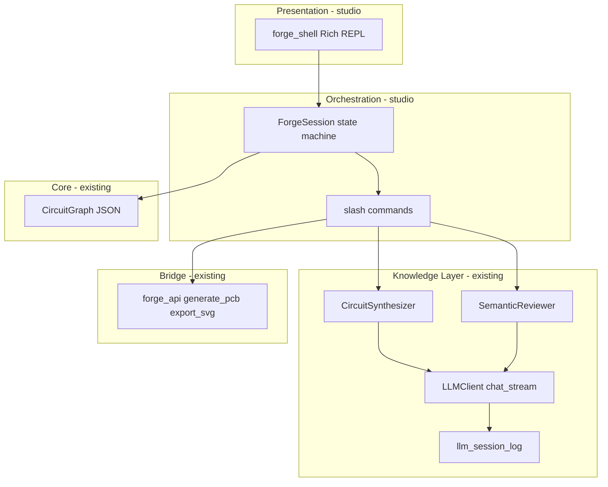

# Forge Studio — Headless LLM Debug Shell (CLI v1)

## Domain placement

This feature belongs to a **new adjunct layer** in the PulseLab architecture—not inside `pulse_lab.py` or `ui/`.

| Concept | Where it lives | Rationale |
|---------|----------------|-----------|
| **Forge Studio** | New package `studio/` | Named milestone already anticipated in [`docs/calibration_forge/index.md`](docs/calibration_forge/index.md) as **Headless Mode** |
| **LLM transport** | [`knowledge/ollama_native.py`](knowledge/ollama_native.py) + [`knowledge/llm_client.py`](knowledge/llm_client.py) | Shared infrastructure; consumed by studio, synthesizer, reviewer, validation harness |
| **Agent logic** | Existing [`knowledge/circuit_synthesizer.py`](knowledge/circuit_synthesizer.py), [`knowledge/semantic_reviewer.py`](knowledge/semantic_reviewer.py) | No duplication of prompts/RAG/pin coverage |
| **Artifact preview** | Thin adapter over [`bridge/forge_api.py`](bridge/forge_api.py) | Schematic SVG via existing `gerber_export.export_svg`; no pygame |
| **Presentation** | `studio/` only | Rich REPL; pygame [`ui/modals.py`](ui/modals.py) unchanged in v1 |



### Architecture rules (must not violate)

From [`docs/architecture/APP_ARCHITECTURE.md`](docs/architecture/APP_ARCHITECTURE.md) and [`docs/architecture/ARCHITECTURE_VIOLATIONS.md`](docs/architecture/ARCHITECTURE_VIOLATIONS.md):

- **`studio/` must not import `ui/` or `pygame`** — headless by design
- **`knowledge/` must not import `studio/`** — one-way dependency: studio → knowledge
- **No blocking in pygame** — studio is a separate process (`python -m studio`); pygame integration deferred
- **Graceful LLM degradation** — shell prints backend status via [`knowledge/llm_backends.py`](knowledge/llm_backends.py); MNA/editor unaffected
- **No new OpenAI API key requirement** — Ollama native path only for streaming v1

### Sprint alignment ([`CURENT_SPRINT.md`](CURENT_SPRINT.md))

Execution order today: **4a (done) → 4c → 4d → 4b → 5**.

Forge Studio **shares transport work with Session 4c** but is a **parallel deliverable** (call it **Session 4e** or a sub-milestone under 4c). Do **not** start Session 4b until 4c P0 guardrails exist—the studio will surface the same truncation failures live.

| Shared with 4c | Studio-only |
|----------------|-------------|
| `chat_native_stream()`, `done_reason` normalization, `messages` / `chat_continue()` | Rich REPL, slash commands, live token display |
| `format` passthrough for reviewer JSON | `ForgeSession` state, schematic path hints |
| Post-parse MCU pin guard (consume, don't reimplement) | Windows console bootstrap |

---

## Research findings (condensed)

### What exists today

- [`knowledge/ollama_native.py`](knowledge/ollama_native.py) line 6: *"stream=true only for interactive UI"* — **not implemented**
- [`knowledge/llm_client.py`](knowledge/llm_client.py) hardcodes `stream=False` (line 188)
- [`ui/forge_controller.py`](ui/forge_controller.py) runs agents in threads with spinner-only UX
- [`knowledge/validate_complex_apps.py`](knowledge/validate_complex_apps.py) is the closest headless orchestrator (batch, not interactive)
- Session logs in `knowledge/data/llm_sessions/` are excellent for post-hoc debug but not live

### Ollama streaming contract (native `/api/chat`)

- POST with `"stream": true` → NDJSON lines; each chunk has `message.content`, `message.thinking`, terminal `done` + `done_reason`
- Qwythos with `think: low` emits **both** channels — ideal for split-pane Rich output
- `num_predict` budgets thinking + content combined ([`llm_output_pipeline.md`](docs/calibration_forge/llm_output_pipeline.md)) — studio should display `done_reason: length` in red immediately

### Windows + Rich constraints

Observed project pattern: cp1252 crashes on Unicode ([`CURENT_SPRINT.md`](CURENT_SPRINT.md) lines 111–112, [`validate_complex_apps._safe_print`](knowledge/validate_complex_apps.py)).

**v1 console policy:**

1. At startup: `sys.stdout.reconfigure(encoding="utf-8", errors="replace")` (same as harness)
2. Document: run in **Windows Terminal** (not legacy conhost) with `$env:PYTHONIOENCODING='utf-8'`
3. Rich: use `Console(legacy_windows=False, force_terminal=True)`; avoid emoji in core output (ASCII status tags: `[thinking]`, `[content]`, `[done]`)
4. Prefer incremental `console.print(chunk, end="")` over `Live` full-screen refresh — fewer PS flicker/resize bugs
5. Add `rich` to [`requirements.txt`](requirements.txt) as a **pinned optional-friendly** dep (`rich>=13,<14`); no Textual in v1 (heavier TTY assumptions)

### Vision (Qwythos mmproj) — out of v1 scope

Defer to a later session: requires `images` in Ollama messages + SVG→PNG raster + Ollama Modelfile with mmproj. Document as Phase 2 research stub in the architecture note only.

---

## Proposed package layout

```
studio/
  __init__.py
  __main__.py          # entry: python -m studio
  session.py           # ForgeSession: graph state, session_id, backend prefs
  commands.py          # slash-command registry (/generate, /review, /backends, /save)
  stream_ui.py         # Rich streaming renderer (thinking vs content columns)
  preview.py           # optional: trigger forge_api + print SVG path (no inline viewer v1)

knowledge/
  ollama_native.py     # + chat_native_stream() -> Iterator[StreamChunk]
  llm_client.py        # + chat_stream(on_chunk=...), + messages param on chat()
  llm_types.py         # NEW: StreamChunk, ChatMessage TypedDicts (thin, no UI deps)

tests/
  test_ollama_native_stream.py   # mock NDJSON iterator
  test_studio_session.py         # command parsing, no live Ollama
```

**Dependency rule diagram:**

```
studio → knowledge, bridge, core
knowledge → (no studio, no ui)
ui/forge_controller → knowledge (unchanged; may adopt chat_stream later)
```

---

## Implementation phases

### Phase 0 — Architecture note (research artifact, ~1h)

Create [`docs/calibration_forge/forge_studio.md`](docs/calibration_forge/forge_studio.md):

- Domain definition, layer diagram, dependency rules
- Explicit non-goals for v1 (no pygame embed, no web canvas, no vision)
- Windows terminal requirements
- Link from [`docs/calibration_forge/index.md`](docs/calibration_forge/index.md) milestone "Headless Mode"
- Handoff pointer in [`CURENT_SPRINT.md`](CURENT_SPRINT.md) as Session 4e

### Phase 1 — LLM transport (dev, shared with 4c P0)

**Files:** [`knowledge/ollama_native.py`](knowledge/ollama_native.py), [`knowledge/llm_client.py`](knowledge/llm_client.py), new `knowledge/llm_types.py`

1. **`StreamChunk` dataclass** — `kind: thinking|content|done|error`, `text`, `done_reason`, `tokens`
2. **`chat_native_stream()`** — `urllib` POST `stream:true`, line-buffered NDJSON parse, yield chunks
3. **`LLMClient.chat_stream(..., on_chunk)`** — accumulates final `content`/`thinking`; calls existing `record_llm_exchange()` once at end (same logging contract as `chat()`)
4. **`LLMClient.chat(..., messages=None)`** — optional full history; default preserves current `system`+`user` behavior
5. **Normalize `done_reason`** on both native and OpenAI paths into `result["done_reason"]` (4c P0 requirement)
6. **Tests** with fixture NDJSON files (no live Ollama in CI)

### Phase 2 — ForgeSession orchestrator (dev)

**Files:** `studio/session.py`, `studio/commands.py`

`ForgeSession` responsibilities (single class, no god-object):

- Hold `CircuitGraph` (from [`core/circuit_graph.py`](core/circuit_graph.py)) or empty
- Own `session_id` via [`knowledge/llm_session_log.new_session_id`](knowledge/llm_session_log.py)
- Delegate generation to `CircuitSynthesizer.generate_circuit_json(..., session_id=...)`
- Delegate review to `SemanticReviewer` (extend signature to accept `session_id`/`meta` — 4c/4d item)
- After generation: load components into graph via `CircuitGraph.from_component_dicts`
- Report pin coverage using synthesizer's existing `_pin_coverage()` (import or thin wrapper — do not copy logic)

**Slash commands (v1 minimum):**

| Command | Action |
|---------|--------|
| `(free text)` | Stream chat-style generate via synthesizer |
| `/generate <prompt>` | Same, explicit |
| `/review` | Stream semantic review of current graph |
| `/backends` | Print `list_backends()` table |
| `/save <path>` | `forge_api.save_json` |
| `/load <path>` | `forge_api.load_json` |
| `/schematic` | `generate_pcb` + `export_svg`, print path (KiCad must be up) |
| `/session` | Print session_id + log dir |
| `/quit` | Exit |

### Phase 3 — Rich CLI shell (dev)

**Files:** `studio/__main__.py`, `studio/stream_ui.py`

- REPL loop with `prompt_toolkit` **not** required — plain `input()` + Rich is enough for v1
- Two-column or stacked layout: dim thinking stream, bright content stream
- On JSON complete: parse with [`knowledge/llm_json.py`](knowledge/llm_json.py), show component count + pin coverage summary
- Wire `on_chunk` from `chat_stream` into `stream_ui.render_chunk()`
- Entry point: `python -m studio [--backend primary] [--model qwythos-9b-96k]`

**Windows smoke test checklist** (manual, documented in forge_studio.md):

- PowerShell + Windows Terminal + `PYTHONIOENCODING=utf-8`
- Ollama `:11431` up with `qwythos-9b-96k`
- Run: `python -m studio` → `/backends` → paste ESP32 sensor prompt → observe thinking/content streams → `/review`

### Phase 4 — Handoff (required per sprint discipline)

Update:

- [`docs/calibration_forge/forge_studio.md`](docs/calibration_forge/forge_studio.md) §Resultado
- [`docs/calibration_forge/index.md`](docs/calibration_forge/index.md) — mark Headless Mode partial (CLI done, web canvas future)
- [`CURENT_SPRINT.md`](CURENT_SPRINT.md) — add Session 4e block with paste-ready agent prompt
- [`docs/roadmap.md`](docs/roadmap.md) — one line under Phase 3 or new "Forge Studio" bullet

---

## What we explicitly defer

| Item | Why |
|------|-----|
| Web canvas / React Forge Studio | User chose CLI v1; `webapp/` stays EMP demo until Phase 2 initiative |
| Pygame modal streaming | Separate adapter later; consumes same `chat_stream` |
| Vision / mmproj | Needs Ollama multimodal setup + image pipeline research |
| Full schematic inline viewer | v1 prints SVG path; user opens in browser/KiCad |
| Session 4b A/B experiment | Blocked until 4c P0 guardrails land |

---

## Risk register

| Risk | Mitigation |
|------|------------|
| 4c transport changes conflict | Implement Phase 1 as **first 4c PR**; studio consumes it immediately after |
| Rich breaks in legacy PS | Document Windows Terminal; ASCII-only output; utf-8 reconfigure |
| Streaming + JSON parse mid-flight | Display raw stream live; parse only on `done`; show `done_reason: length` prominently |
| KiCad absent for `/schematic` | Check `kicad_bridge.status()` before subprocess; print clear error |
| Duplicate orchestration logic | `ForgeSession` calls existing agents; zero prompt duplication |

---

## Success criteria (v1)

- `python -m studio` runs headless (no pygame import)
- Live thinking + content tokens visible during qwythos generation
- Generated circuit loads into session graph; `/review` streams reviewer output
- All calls logged under shared `session_id` in `knowledge/data/llm_sessions/`
- `pytest` green including stream parser unit tests
- Windows Terminal smoke test documented and passing
