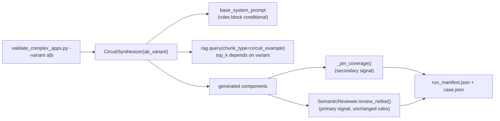

# Unblock and run Session 4b (Prompt vs. RAG A/B experiment)

## Scope (per your answers)
- Fix infra blockers, then execute the full 10-run A/B experiment and record raw results.
- Stop before making the subjective rule-trim / DesignExperience-migration decisions (Session 4b tasks 2-3) — those get documented as an explicit follow-up, not decided here.
- Session 5 (repo hygiene) stays out of this plan entirely.

## Phase 1 — Fix the two confirmed config/data blockers

1. **`Pulse_cfg.json`**: change `llm.agents.circuit_synthesizer.rag_top_k` from `0.95` to `1`. This is the root cause of `int(cfg(...)) == 0` in [`knowledge/circuit_synthesizer.py:340`](knowledge/circuit_synthesizer.py) silently disabling `circuit_example` RAG injection in every past run. Fixing it restores the documented variant-(a) baseline for everyone (UI, MCP, harness), not just the A/B experiment.
2. **Rebuild the dense embedding index**: run `python -m knowledge.build_embed_index`. Confirmed both Ollama (`primary`) and the `nomic-embed-text` embed endpoint are live right now, so this is unblocked. This regenerates `knowledge/data/embeddings/vectors.npy` / `manifest.json` so `chunk_count` matches the live 5685 chunks (currently stale at 358), making the `hybrid` backend actually hybrid instead of silently TF-IDF-only.
3. Run `pytest tests/` to confirm no regressions from the config change (baseline: 79 passed).

## Phase 2 — Build the A/B toggle and the missing evaluation signal

### 2a. A/B variant toggle in `knowledge/circuit_synthesizer.py`
- Add `ab_variant: str = "a"` to `CircuitSynthesizer.__init__` (default preserves current behavior for all existing callers: `ui/forge_controller.py`, `mcp_server/server.py`, tests).
- Refactor the inline `"REGLAS UART / USB (OBLIGATORIAS): ..."` block (currently hardcoded inside the `base_system_prompt` triple-quoted string, [lines 60-65](knowledge/circuit_synthesizer.py)) into its own constant/method so it can be conditionally omitted when `ab_variant == "b"`, without fragile string surgery.
- Add a small variant-aware top_k resolution (new cfg key `llm.agents.circuit_synthesizer.rag_top_k_variant_b`, default `4`) used in `_build_system_prompt()` instead of always reading `rag_top_k` — variant "a" keeps reading `rag_top_k` (now `1`), variant "b" reads `rag_top_k_variant_b` (`3-5` range per the sprint spec).
- Thread `ab_variant` into the result dict / logged metadata so output files are traceable to the variant that produced them.

### 2b. Wire `semantic_reviewer` into the harness (`knowledge/validate_complex_apps.py`)
- Import `SemanticReviewer` and instantiate once per run.
- After each case's `generate_circuit_json()` call, call `reviewer.review_netlist(json.dumps({"components": components}))` and capture `issues` (+ total/critical counts) — this is the "primary signal" the sprint doc says is missing today (currently only `_pin_coverage()` runs).
- Add `--variant {a,b}` CLI flag (default `"a"`), passed through to `CircuitSynthesizer(backend=..., ab_variant=args.variant)`.
- Persist `"semantic_review"` (issues + counts) and `"variant"` alongside the existing `"pin_coverage"` key in both the per-case JSON and `run_manifest.json`.

### 2c. Small regression test
- Add a lightweight test (e.g. in `tests/test_circuit_engine.py` or a new `tests/test_ab_variant.py`) that instantiates `CircuitSynthesizer(ab_variant="b")` and asserts the OBLIGATORIAS block is absent from `.base_system_prompt` while `ab_variant="a"` (default) keeps it — no LLM call needed since prompt construction is synchronous in `__init__`.

### 2d. Document the new metric
- Add a short section to [`docs/calibration_forge/evaluation_metrics.md`](docs/calibration_forge/evaluation_metrics.md) formally defining the semantic-review issue-count signal (total issues, critical issues) now recorded per run, mirroring how Pin Coverage Fidelity is documented there.

## Phase 3 — Run the real experiment

4. Execute the 5-case suite twice, sequentially (only `primary` backend is available — `atomic` is down, matching prior sessions):
   - `python -m knowledge.validate_complex_apps --variant a`
   - `python -m knowledge.validate_complex_apps --variant b`
   - Expect roughly 1-2+ hours total wall time (Session 4a's `esp32_sensors` alone took ~7 min on `primary`); this will run as a long background task.
   - Outputs land under `knowledge/data/validation_complex/runs/<timestamp>_<session>/` as usual — no overwrites of prior runs.
5. Compile a comparison table (pin coverage avg, semantic-review issue counts total/critical, elapsed time) per case, variant (a) vs (b).

## Phase 4 — Record results and hand off (no rule-trim decision made)

6. Append a dated "§Resultado A/B — Session 4b, parte 1 (experimento, sin decisión de trimming)" section to [`docs/calibration_forge/prompt_vs_rag_balance.md`](docs/calibration_forge/prompt_vs_rag_balance.md) with the raw comparison table and links to the run folders.
7. Explicitly flag in that same doc that Session 4b tasks 2-3 (deciding what to trim, migrating to `DesignExperience`) remain **open and require human judgment** — not resolved by this pass, per your chosen scope.
8. Update `CURENT_SPRINT.md` / `docs/calibration_forge/index.md` handoff notes to reflect: infra blockers fixed, experiment data collected, trim decision pending.
9. Update `docs/calibration_forge/session_4b_preflight_verification.md` (created earlier this session) to mark the 4 blockers as resolved with pointers to the fixes/results above.

## Files touched
- `Pulse_cfg.json` (config fix + new variant-b key)
- `knowledge/circuit_synthesizer.py` (ab_variant support)
- `knowledge/validate_complex_apps.py` (--variant flag, semantic_reviewer wiring)
- `knowledge/data/embeddings/vectors.npy` + `manifest.json` (regenerated data, not hand-edited)
- New/updated test file for the variant toggle
- `docs/calibration_forge/evaluation_metrics.md`, `prompt_vs_rag_balance.md`, `CURENT_SPRINT.md`, `docs/calibration_forge/index.md`, `docs/calibration_forge/session_4b_preflight_verification.md` (docs)
- New run artifacts under `knowledge/data/validation_complex/runs/` and `knowledge/data/llm_sessions/`
