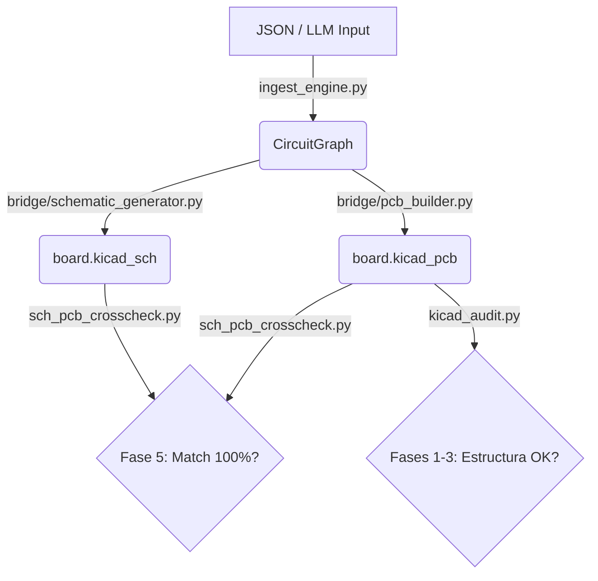

# Arquitectura y Flujo Generativo de PulseLab

Este documento establece la **Única Fuente de Verdad (Single Source of Truth - SSOT)**, los criterios de diseño y el flujo generativo del sistema de creación de PCBs por código (PulseLab).

## 1. Única Fuente de Verdad (SSOT)

Para garantizar la coherencia absoluta entre esquemáticos, PCBs y reportes, el sistema impone reglas estrictas sobre dónde reside la verdad de cada aspecto del diseño.

*   **Definición Topológica y Componentes (Hardware Design Intent):**
    *   **Dónde reside:** Archivos JSON de definición en `knowledge/data/` (ej. `flipper_multiboard_pcb.json`).
    *   **Misión:** Es el único lugar donde se definen las redes (nets), los componentes, los footprints y sus conexiones. **Ningún script generador debe inventar o deducir redes que no estén en el JSON o en el CircuitGraph derivado.**
*   **Representación en Memoria (Modelo de Dominio):**
    *   **Dónde reside:** Instancia de `CircuitGraph` (creada por `circuit_engine.py` a partir del JSON).
    *   **Misión:** Proveer a todos los "builders" una vista unificada y validada del circuito. Garantiza que esquemático y PCB usen exactamente los mismos Reference Designators (`U1`, `R2`) y Net Names (`3.3V`, `GND`).
*   **Reglas de Validación y Criterio de Auditoría:**
    *   **Dónde reside:** `core/RULES.md`.
    *   **Misión:** Define las fases (0 a 5) y las reglas (R001 a R012) que determinan qué es un PCB válido. `kicad_audit.py` y `sch_pcb_crosscheck.py` son meras implementaciones de estas reglas. Si hay discrepancia, `RULES.md` tiene la última palabra.

## 2. Flujo Generativo Unidireccional

El flujo de información es estrictamente **unidireccional** (Top-Down) para evitar desincronizaciones:

### Reglas de Oro del Generador:
1.  **Nunca modificar `.kicad_pcb` o `.kicad_sch` a mano ni mediante parches de texto (sed/regex).** Cualquier cambio en el circuito debe hacerse en el origen (JSON) y regenerar todo a través del `CircuitGraph`.
2.  **Generación Paralela:** `schematic_generator.py` y `pcb_builder.py` deben consumir la *misma* instancia de `CircuitGraph`. Esto asegura por diseño que la cantidad de componentes, los designadores y las redes sean idénticos, pasando automáticamente la Fase 5.
3.  **Los pines determinan la conectividad:** Un símbolo en el esquemático sin la declaración explícita `(pin ...)` no tiene conectividad eléctrica, solo visual. El `schematic_generator.py` debe inferir o inyectar pines reales mapeando contra el footprint.

## 3. Manejo de Errores y Evolución

Si `kicad_audit.py` o `sch_pcb_crosscheck.py` fallan, el flujo de resolución es:
1. Identificar la regla violada (ej. `R002: Pad sin red`, o `Mismatch de nets`).
2. Corregir el generador subyacente (`pcb_builder.py` / `schematic_generator.py`) o corregir la entrada `JSON`.
3. Regenerar y volver a correr los tests.
4. Jamás alterar el output de KiCad para saltarse el test.
