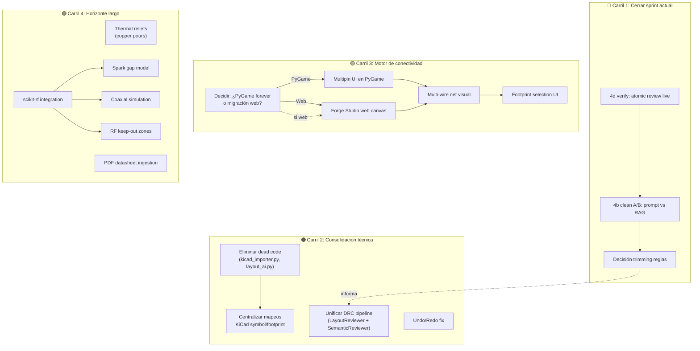

# PulseLab Forge — Auditoría de coherencia y mapa de desarrollo futuro

> Cruce profundo de código fuente, docs de status, roadmap, reviews, y calibration forge.
> Fecha: 10-jul-2026

---

## 1. Duplicidades detectadas en el código

### 🔴 DUP-1: Tres parsers de KiCad `.kicad_sch` haciendo lo mismo

| Archivo | Clase | Qué hace | Quién lo usa |
|---------|-------|----------|-------------|
| [core/kicad_importer.py](file:///c:/Users/soyko/Documents/Pulse-main/core/kicad_importer.py) | `KicadImporter` | Parsea `.kicad_pcb` (nets + componentes + connectivity) | [core/ingest_engine.py](file:///c:/Users/soyko/Documents/Pulse-main/core/ingest_engine.py), [knowledge/calibration_run.py](file:///c:/Users/soyko/Documents/Pulse-main/knowledge/calibration_run.py), tests |
| [knowledge/kicad_importer.py](file:///c:/Users/soyko/Documents/Pulse-main/knowledge/kicad_importer.py) | `KiCadSchematicImporter` | Parsea `.kicad_sch` → CircuitGraph (básico, no extrae `title_block` ni wires) | Solo su propio `__main__` — **nunca importado por nadie** |
| [knowledge/kicad_schematic_parser.py](file:///c:/Users/soyko/Documents/Pulse-main/knowledge/kicad_schematic_parser.py) | `KiCadSchematicParser` | Parsea `.kicad_sch` con contexto de diseño (title_block, labels, text) | [knowledge/dataset_builder.py](file:///c:/Users/soyko/Documents/Pulse-main/knowledge/dataset_builder.py) |

> [!WARNING]
> `knowledge/kicad_importer.py::KiCadSchematicImporter` es **dead code**: nadie lo importa fuera de su propio `__main__`. Es una versión anterior y menos capaz que `KiCadSchematicParser` (no extrae title_block, no extrae labels, no extrae valores numéricos correctamente). **Debe eliminarse.**

**Acción recomendada:** Eliminar `knowledge/kicad_importer.py`. `KiCadSchematicParser` ya hace todo lo que éste hacía, mejor.

---

### 🔴 DUP-2: Doble osciloscopio (PyGame + React) sin relación

| Archivo | Stack | Propósito |
|---------|-------|-----------|
| [ui/oscilloscope.py](file:///c:/Users/soyko/Documents/Pulse-main/ui/oscilloscope.py) | PyGame | Osciloscopio del editor nativo: 4 canales, tiempo real, integrado con `SimulationRunner` |
| [webapp/src/components/Oscilloscope.tsx](file:///c:/Users/soyko/Documents/Pulse-main/webapp/src/components/Oscilloscope.tsx) | React/Canvas | Osciloscopio del simulador EMP web: 1 canal, estático, sin conexión al motor MNA |

Estos **no son duplicados funcionales** (uno es simulación real, otro es visual para la webapp EMP), pero sí representan **esfuerzo divergente**: si el roadmap planea un "Forge Studio web canvas", ¿se construirá un tercer osciloscopio? ¿O se reutilizará uno de estos?

**Acción recomendada:** Cuando llegue el Forge Studio web canvas, reutilizar la interfaz de `Oscilloscope.tsx` conectándola al motor MNA real vía WebSocket/API.

---

### 🟡 DUP-3: Layout reviewer duplicado (reglas estáticas vs. AI)

| Archivo | Tipo | Qué revisa |
|---------|------|------------|
| [knowledge/layout_reviewer.py](file:///c:/Users/soyko/Documents/Pulse-main/knowledge/layout_reviewer.py) | **Reglas estáticas** (Python puro) | Out-of-bounds, clearance entre footprints |
| [knowledge/semantic_reviewer.py](file:///c:/Users/soyko/Documents/Pulse-main/knowledge/semantic_reviewer.py) | **LLM-based** (AI DRC) | GND aislado, desacoplo, pines flotantes, UART crossover |

Estos no son exactamente duplicados, sino **capas complementarias** que hoy no están coordinadas. `LayoutReviewer` opera sobre objetos `PCBLayout`; `SemanticReviewer` opera sobre JSON/netlist. Pero el roadmap menciona "Interactividad AI — popup revisión semántica" sin definir cómo se integran ambas capas.

**Acción recomendada:** Unificarlos bajo una API de `audit()` que ejecute primero las reglas deterministas (`LayoutReviewer`) y luego las heurísticas LLM (`SemanticReviewer`), con un resultado consolidado.

---

### 🟡 DUP-4: Dos sistemas de recolección de datos de diseño

| Módulo | Qué graba | Dónde persiste |
|--------|-----------|----------------|
| [knowledge/layout_ai.py](file:///c:/Users/soyko/Documents/Pulse-main/knowledge/layout_ai.py) `LayoutAI.record_design()` | Circuito completo como JSON para "futuro entrenamiento GNN" | `knowledge/data/training/sample_*.json` |
| [knowledge/design_experience.py](file:///c:/Users/soyko/Documents/Pulse-main/knowledge/design_experience.py) `record_design_outcome()` | Experiencia con lecciones + métricas, ingesta en RAG | `knowledge/experiences/*.json` + chunks RAG |

`LayoutAI.record_design()` tiene `suggest_layout()` como placeholder vacío (TODO) y su clase `LayoutAI` no es referenciada por nadie activo en el pipeline. `design_experience.py` **sí** está integrado (Session 2) y produce datos útiles.

> [!IMPORTANT]
> `layout_ai.py` es prácticamente dead code: `suggest_layout()` es un pass, y `record_design()` guarda datos que nadie consume. El trabajo de grabación de datos ya lo hace `design_experience.py` mejor y con RAG.

**Acción recomendada:** Si el entrenamiento GNN sigue en el backlog, mantener `layout_ai.py` pero marcar como experimental. Si no, deprecar.

---

### 🟡 DUP-5: Mapeo de símbolos KiCad repetido en 3+ archivos

El mapeo `etype → KiCad symbol` está hardcodeado independientemente en:

| Archivo | Variable/Lógica |
|---------|----------------|
| [core/netlist.py](file:///c:/Users/soyko/Documents/Pulse-main/core/netlist.py) L25-41 | `_KICAD_SYMBOLS` + `_DEFAULT_FOOTPRINTS` |
| [bridge/schematic_generator.py](file:///c:/Users/soyko/Documents/Pulse-main/bridge/schematic_generator.py) L33-44 | `VALUE_SYMBOL_MAP` (para ICs/MCUs) |
| [knowledge/kicad_schematic_parser.py](file:///c:/Users/soyko/Documents/Pulse-main/knowledge/kicad_schematic_parser.py) L16-24 | `type_patterns` (reverso: KiCad → etype) |
| [knowledge/kicad_importer.py](file:///c:/Users/soyko/Documents/Pulse-main/knowledge/kicad_importer.py) L12-18 | `comp_map` (otro reverso, distinto) |
| [knowledge/kicad_layout_parser.py](file:///c:/Users/soyko/Documents/Pulse-main/knowledge/kicad_layout_parser.py) L13-21 | `type_patterns` (otro mapeo más) |

Son **5 mapeos independientes** que pueden divergir silenciosamente. Si alguien añade soporte para un tipo nuevo (ej. `MOSFET`), tiene que actualizar hasta 5 archivos.

**Acción recomendada:** Centralizar en un módulo canónico (ej. `core/component_types.py`) con los mapeos bidireccionales.

---

## 2. Incompatibilidades y conflictos entre planes

### ⚠️ CONF-1: "Modelo Multipin" vs. `PlacedComponent` actual

El roadmap menciona "Modelo Multipin — Editor + netlist + esquemáticos" como trabajo de estabilización cross-cutting. Pero el modelo actual [PlacedComponent](file:///c:/Users/soyko/Documents/Pulse-main/core/circuit_graph.py#L37-L55) ya soporta `pins: Dict[str, str]` para componentes multi-pin (ICs, MCUs). El campo `pins` coexiste con `n1`/`n2` para componentes de 2 pines.

**El conflicto real** no es de modelo de datos (eso ya está), sino de **UI**: el editor PyGame ([ui/editor.py](file:///c:/Users/soyko/Documents/Pulse-main/ui/editor.py), 43KB) dibuja todos los componentes como cajas de 2 pines con la misma renderización. Hacer "Modelo Multipin" sin resolver la UI es incompleto, pero resolver la UI lleva a la pregunta: ¿se sigue invirtiendo en el editor PyGame, o se migra al "Forge Studio web canvas"?

> [!CAUTION]
> **Riesgo de trabajo perdido:** Si el roadmap Phase 3 incluye "Forge Studio web canvas" como reemplazo de la UI PyGame, invertir en features PyGame (Cyber Night theme, Wire Glow, Multipin UI, Footprint selection UI, particles/glassmorphism) sería **trabajo desechable**. Se decide que PyGame es transitorio.

---

### ⚠️ CONF-2: "Multi-wire net propagation" vs. estado real del autorouter

El roadmap (Connectivity Engine, Phase 1-2) lista:
- `[ ] Multi-wire net propagation logic`
- `[ ] Visual verification of complex nodes`

Pero el autorouter A* en [pcb_layout.py](file:///c:/Users/soyko/Documents/Pulse-main/bridge/pcb_layout.py) ya implementa enrutado multi-net con detección de colisiones. La pregunta es: ¿"multi-wire net propagation" se refiere al **autorouter** (ya resuelto) o al **editor visual** (wires en el canvas PyGame que conectan a múltiples nodos)?

Si es lo segundo, esto **depende de CONF-1** (Modelo Multipin + UI). Si es lo primero, probablemente ya está hecho y el roadmap necesita actualizarse.

---

### ⚠️ CONF-3: Prompt engineering (Session 4b) vs. Phase 5 (HV Specialization)

Phase 5 planea añadir modelos de **spark gap**, **transmission line coaxial** y **RF keep-out zones**. Estos son componentes con comportamiento altamente especializado que el LLM **no va a poder inferir** solo por RAG — requieren modelos matemáticos en código (como ya existe en [rf_tools.py](file:///c:/Users/soyko/Documents/Pulse-main/core/rf_tools.py)).

Sin embargo, Session 4b está explorando eliminar reglas fijas del prompt a favor de RAG. Si Phase 5 requiere que el LLM conozca reglas de spark gap/RF, esas reglas tendrían que volver al prompt o inyectarse condicionalmente.

**No es una incompatibilidad hard**, pero necesita diseño: las reglas especializadas de HV deberían ser **condicionales** (inyectadas solo cuando se detecta componente RF/HV), no eliminarse como parte de un trimming general.

---

## 3. Soluciones superiores que hacen redundante otro trabajo planificado

### ✅ SUP-1: KiCad Symbol KB → hace redundante el "Footprint selection UI" manual

Session 4a indexó **5320 símbolos KiCad** en el RAG. Si el pipeline ya puede recuperar automáticamente el símbolo y footprint correcto para un componente dado, un "Footprint selection UI in Properties Panel" (roadmap) sería **override manual de algo que ya funciona automáticamente**. Sigue siendo útil como escape hatch, pero su prioridad baja drásticamente.

### ✅ SUP-2: `SemanticReviewer` con backend `atomic` → supera a "Interactividad AI — popup revisión semántica"

Session 4d implementó dual-backend orchestration para que la revisión semántica corra en el backend `atomic` (rápido). Esto hace que un "popup de revisión" sea viable en tiempo real. Pero el popup no es un proyecto independiente — es simplemente **UI sobre algo que ya funciona headless**. No debería listarse como item de estabilización separado, sino como sub-tarea del canvas web/PyGame.

### ✅ SUP-3: Forge Studio CLI → reduce necesidad de mejoras cosméticas PyGame

Si Forge Studio evoluciona a web canvas, las features cosméticas de Phase 3 (Cyber Night, Wire Glow, particles) deberían implementarse **en web**, no en PyGame. El editor PyGame debería mantenerse funcional pero no recibir inversión estética.

### ✅ SUP-4: Copper pours (backlog) depende de un problema ya resuelto

"Copper pours con thermal reliefs" estaba en el backlog como P3 desde la review de abril. Pero el motor PCB ya genera planos de cobre básicos ([pcb_layout.py](file:///c:/Users/soyko/Documents/Pulse-main/bridge/pcb_layout.py)). El gap real es solo **thermal reliefs** en la conexión pad-plano, que es un refinamiento del generador `.kicad_pcb`, no una feature nueva completa.

---

## 4. Mapa de desarrollo futuro propuesto

Basado en el análisis anterior, reorganizo todo el trabajo pendiente en **4 carriles paralelos** con dependencias explícitas:



---

## 5. Epics priorizados

### Epic 1: Sprint cleanup (1-2 sesiones)
| # | Tarea | Esfuerzo | Bloqueado por |
|---|-------|----------|---------------|
| 1.1 | Verificar 4d live (atomic review) | 1h | — |
| 1.2 | Session 4b clean A/B (5+5 cases) | 2-3h | 1.1 |
| 1.3 | Decisión de trimming | 30min | 1.2 |

### Epic 2: Limpieza de deuda técnica (1-2 días)
| # | Tarea | Esfuerzo | Bloqueado por |
|---|-------|----------|---------------|
| 2.1 | Eliminar `knowledge/kicad_importer.py` (dead code) | 15min | — (x) Completado |
| 2.2 | Evaluar deprecación de `knowledge/layout_ai.py` | 30min | — (x) Completado |
| 2.3 | Centralizar mapeos `etype ↔ KiCad symbol ↔ footprint` en 1 módulo | 2-3h | 2.1 (x) Completado |
| 2.4 | Unificar `LayoutReviewer` + `SemanticReviewer` bajo API `audit()` | 3-4h | — (x) Completado |
| 2.5 | Undo/Redo snapshot-first fix | 2-3h | — (x) Completado |

### Epic 3: Decisión estratégica de UI (⚡ decisión clave)

> [!IMPORTANT]
> **Esta es la decisión más impactante que puedes tomar ahora.** Todo el trabajo de Phase 3 (UI premium) depende de ella.

| Opción | Pros | Contras |
|--------|------|---------|
| **A: PyGame es el futuro** | Ya funciona, todo el editor está ahí (43KB), no hay migración | PyGame es limitado para UX moderna, no soporta glassmorphism/web, difícil de distribuir |
| **B: Web canvas es el futuro** | Estética premium posible, distribuible como URL, React/Canvas ya arrancado en `webapp/` | Requiere reescribir todo el editor, comunicación con backend Python, el `webapp/` actual es solo un simulador EMP |
| **C: Híbrido** | PyGame funcional + web para visualización/revisión, Forge Studio CLI como puente | Doble mantenimiento, complejidad |

> [!TIP]
> **Acelerador para el Web Canvas:** El repositorio abierto `buildwithflux/kicad-module-parser` (basado en PegJS) permite parsear `.kicad_pcb`, `.kicad_mod` y `.kicad_sym` directamente en TypeScript/JavaScript. Esto reduce enormemente el esfuerzo de la Opción B, ya que el frontend React podría ingerir los archivos nativos de KiCad para renderizar layouts y footprints sin requerir un puente complejo de serialización JSON en el backend Python.

Mi recomendación: **Opción C a corto plazo, transición a B a largo plazo.** No inviertas en estética PyGame. El Forge Studio CLI ya funciona como puente headless. Cuando hagas el web canvas, construye sobre `webapp/` con React + Canvas2D/WebGL.

### Epic 4: Motor de conectividad (5-8 días)
| # | Tarea | Esfuerzo | Bloqueado por |
|---|-------|----------|---------------|
| 4.1 | Clarificar qué es "multi-wire net propagation" en el roadmap | 1h | — |
| 4.2 | Multipin visual (en la UI elegida) | 3-5 días | Epic 3 |
| 4.3 | Footprint selection UI (override manual) | 1-2 días | 4.2 |
| 4.4 | Confirmation dialog footprint overrides | 0.5 días | 4.3 |

### Epic 5: High-Voltage / RF (horizonte lejano)
| # | Tarea | Esfuerzo | Bloqueado por |
|---|-------|----------|---------------|
| 5.1 | scikit-rf integration (S-parameters) | 3-4 días | — |
| 5.2 | Thermal reliefs en copper pours | 2-3 días | — |
| 5.3 | PDF datasheet ingestion (pdfminer) | 2-3 días | — |
| 5.4 | Spark gap component model | 3-5 días | 5.1 |
| 5.5 | Coaxial transmission line model | 3-5 días | 5.1 |
| 5.6 | RF keep-out zone auto-generation | 2-3 días | 5.4, 5.5 |

### Epic 6: Multi-Turn Agent Loop (Tiny Steward Architecture)
| # | Tarea | Esfuerzo | Bloqueado por |
|---|-------|----------|---------------|
| 6.1 | Implementar `CircuitStewardAgent` (XML tags) | 1 día | — (x) Completado |
| 6.2 | Integrar interfaz `/steward` interactiva en `python -m studio` | 1 día | 6.1 (x) Completado |
| 6.3 | Migración de XML a **Native API (OpenAI Tool Calling)** para `qwythos` | 1 día | 6.2 |
| 6.4 | Añadir skill `validate_drc` bajo demanda | 2-3 días | 6.3 |
| 6.5 | Añadir skill `search_library` para no inventar símbolos KiCad | 1 día | 6.3 |

#### Epic 6 - Migration Plan Notes (Native API Tool Calling)
*Deferred for a future sprint (Changes one at a time)*
1. **`knowledge/circuit_agent.py`**: Refactor `run_agent_loop` to remove XML regex parsing. Update `_STEWARD_SYSTEM_PROMPT` to use JSON schema tool calling format. Pass `tools` array to LLM via `llm_client.py`.
2. **`knowledge/llm_client.py`**: Verify that `_chat_openai` supports passing the `tools` kwarg directly to the OpenAI client (via `**call_kwargs`).
3. **Skills**: Add `search_library` to let LLM query KiCad symbols dynamically, and `validate_drc` to let it evaluate draft netlists before finishing.

---

## 6. Resumen de acciones inmediatas

```
Acción inmediata                            Tipo          Impacto
──────────────────────────────────────────────────────────────────
1. Cerrar 4d → 4b → trimming               Sprint        🔴 Alto
2. Eliminar knowledge/kicad_importer.py     Dead code     🟡 Bajo
3. Decidir PyGame vs Web (Epic 3)           Estrategia    🔴 Alto  
4. Centralizar mapeos KiCad (DUP-5)        Deuda técnica 🟡 Medio
5. Unificar pipeline DRC (DUP-3)           Arquitectura  🟠 Medio
6. Migrar Tool Calling a Native API (6.3)  Estabilización🟢 Medio
```

> [!TIP]
> Los items 1 y 3 son los que más impacto tienen. El item 1 cierra deuda de sprint. El item 3 desbloquea toda la inversión futura en UI.
