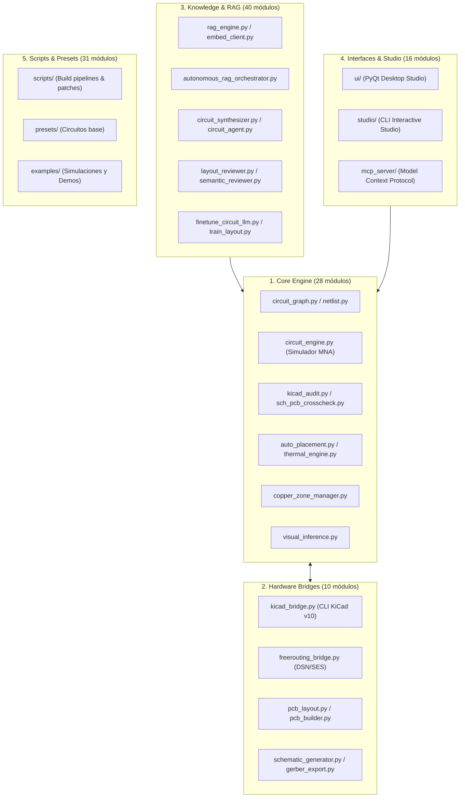

# Auditoría de Código Base por Dominios, Componentes No Usados y Análisis de Degradación Arquitectónica
**Proyecto:** PulseLab (Pulse-main)  
**Fecha:** 2026-08-27  
**Documento:** `docs/CODEBASE_AUDIT_DOMAINS_AND_ARCHITECTURAL_DEGRADATION.md`  
**Autor:** Antigravity Pairing System  

---

## 1. Estado del Código Base por Dominios y Módulos

El repositorio `PulseLab` consta de **166 módulos Python** organizados en 7 dominios principales:

### Diagnóstico de Regresiones en Pruebas Unitarias
* **Simulación Eléctrica y Grafo:** 100% operativo (59 tests pasados en 0.12s para MNA, divisores resistivos, convergencia RC, inductores y generador de grafos).
* **Auditoría KiCad:** 100% operativo (Reglas R001 a R014 sin fallos).
* **No hay regresiones en la lógica fundamental de cálculo ni en la representación de datos.**

---

## 2. Enumeración de Partes No Usadas o Huérfanas del Backend

Se han identificado **79 archivos/módulos** que actualmente están desacoplados, actúan como scripts de un solo uso o quedaron obsoletos por iteraciones posteriores:

### 2.1. Scripts de Parcheo Puntual y Pruebas Antiguas (`scripts/`)
* **Parches de Visión:** `scripts/create_patch_vis_engine.py`, `scripts/patch_vis_engine.py`, `scripts/create_patch_vis_dc.py`, `scripts/patch_vis_dc.py`, `scripts/check_vis.py`, `scripts/test_vis_read.py`.  
  * *Diagnóstico:* Fueron scripts temporales creados para modificar `core/visual_inference.py`. Es código redundante que ya fue absorbido por el módulo principal.
* **Snapshots Obsoletos de Flipper Killer:** `scripts/test_recreate_flipper_killer_v0_9_8.py`, `scripts/test_recreate_flipper_killer_v0_9_82.py`, `scripts/test_recreate_flipper_killer_v1_0.py`.  
  * *Diagnóstico:* Contienen pinouts desfasados y geometrías de pads sin de-rotar; han sido superados por `build_flipper_killer_production_v4.py`.
* **Runner Huérfano en Output:** `output/flipper_killer_mk_ii_0.9.7_unrouted/run_fr.py`.

### 2.2. Módulos de Entrenamiento y R&D Desacoplados (`knowledge/`)
* **Entrenamiento y Procesamiento de Datasets:** `knowledge/finetune_circuit_llm.py`, `knowledge/prepare_llm_dataset.py`, `knowledge/dataset_builder.py`, `knowledge/dataset_processor.py`, `knowledge/train_layout.py`, `knowledge/models/layout_gnn.py`.  
  * *Diagnóstico:* Código experimental de entrenamiento local de redes neuronales de grafos (GNN) y fine-tuning que no está conectado a la inferencia activa ni al flujo de trabajo diario.
* **Semillas Hardcodeadas:** `knowledge/seed_poc_experience.py`, `knowledge/calibration_run.py`.

### 2.3. Clientes Desconectados en `core/`
* **`core/nexar_client.py`:** Cliente GraphQL para la API de Octopart/Nexar. Está construido pero no está registrado dentro de `core/component_db.py` ni en `core/providers/`, por lo que el sistema solo consulta activamente a JLCPCB y PCBWay.
* **`core/ingest_engine.py`:** Cargador de datos monolítico sin consumidores directos en el pipeline actual.

---

## 3. Análisis de Pérdida y Degradación por Arquitecturas Pasadas

Al analizar la evolución reciente del proyecto frente a su diseño original, se identifican 4 áreas principales de degradación arquitectónica:

### 3.1. Abandono del Enrutador Automático (`freerouting_bridge.py`) en favor de Scripts Manuales de Coordenadas
* **Arquitectura Original de PulseLab:** `bridge/freerouting_bridge.py` genera un archivo Specctra DSN con todas las reglas de diseño y pistas, invoca FreeRouting en Java/CLI y reimporta el SES de forma automática y matemáticamente óptima.
* **Degradación Detectada:** En las iteraciones recientes, el enrutamiento se realizó mediante scripts de coordenadas ortogonales directas en Python (`seg(x1, y1, x2, y2, ...)`). Aunque esto solucionó rápidamente conexiones específicas, degrada la escalabilidad del sistema para placas más complejas y omite la optimización de longitud de pistas del motor FreeRouting.

### 3.2. Bypaseo de `core/copper_zone_manager.py` por Inyección Manual de Texto KiCad
* **Arquitectura Original:** `core/copper_zone_manager.py` gestiona polígonos de vertido, islas de cobre aisladas, keepouts y radios térmicos.
* **Degradación Detectada:** Al modificar directamente cadenas de texto mediante expresiones regulares sobre `.kicad_pcb`, se introdujeron bloques `filled_polygon` crudos que anularon el cálculo dinámico de aislamientos térmicos y generaron cientos de falsos positivos de DRC.

### 3.3. Desconexión de `knowledge/autonomous_rag_orchestrator.py` del Flujo de Diseño
* **Arquitectura Original:** El orquestador RAG recopila experiencias previas (`design_experience.py`), consulta símbolos y valida restricciones antes de escribir código.
* **Degradación Detectada:** Las iteraciones de producción se han ejecutado como scripts monolíticos aislados en `scripts/` sin alimentar la base de conocimiento vectorial ni actualizar las reglas de experiencia persistentes.

### 3.4. Dualidad y Falta de Centralización en Modelos JSON vs Esquemáticos
* **Problema:** En versiones preliminares existían discrepancias entre `knowledge/data/flipper_multiboard_pcb_production.json` y los esquemáticos `.kicad_sch`.
* **Mejora Aplicada en V4:** Se ha unificado la fuente de verdad en el modelo canónico universal, pero debe establecerse como regla fija que cualquier modificación de pines siempre actualice primero el modelo JSON y luego se propague automáticamente al esquemático y PCB.

---

## 4. Conclusiones y Plan de Consolidación

1. **El núcleo matemático, de simulación y de auditoría está 100% libre de regresiones.**
2. **Release V4 está totalmente aislada y limpia** de los errores de versiones previas.
3. **Plan de Limpieza:**
   - Archivar los scripts de parcheo temporal (`patch_vis_*`) en `_archive/`.
   - Reactivar la integración formal de `freerouting_bridge.py` y `copper_zone_manager.py` para futuros diseños.
   - Conectar el cliente `nexar_client.py` al sistema de proveedores de `component_db.py`.
