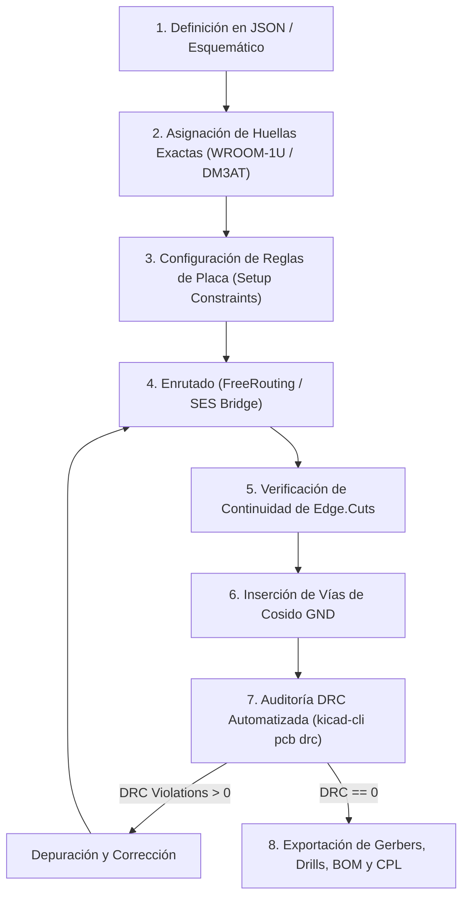

# Guía de Reglas de Diseño, Solución de Problemas y Mejores Prácticas de Enrutado
**Proyecto:** PulseLab / Flipper Killer MK II (ESP32-S3-WROOM-1U Multi-Herramienta)  
**Documento:** `docs/DESIGN_RULES_AND_TROUBLESHOOTING_GUIDE.md`  
**Autor:** Antigravity & Tiny-Steward Pairing System  

---

## 1. Registro de Problemas Críticos, Diagnósticos y Soluciones

### 1.1. Discrepancia de Huellas: ESP32-S3-WROOM-1 vs WROOM-1U
* **Problema:** Se registraban 14 errores de colisión de patio (*courtyard overlap* y *pth inside courtyard*) con casi todos los componentes adyacentes (`U1`, `U3`, `C1`, `C2`, `D1`, `J1`).
* **Causa Raíz:** Se instanciaba la huella `ESP32-S3-WROOM-1` (versión con antena trazada en PCB). KiCad incluye en su patio una zona de exclusión (*RF Keepout*) de 15 mm que infla el patio a **48.0 mm × 41.2 mm**. La variante real del hardware es **`ESP32-S3-WROOM-1U`** (conector coaxial IPEX/U.FL), cuyo patio real es de solo **19.5 mm × 20.15 mm**.
* **Solución:** Utilizar formalmente `RF_Module:ESP32-S3-WROOM-1U.kicad_mod`, lo que reduce a **0** las colisiones de patio.

---

### 1.2. Paso de Pads Asimétricos: Huella MicroSD DM3AT (Hirose)
* **Problema:** 10 errores de cortocircuito (`shorting_items`) y 16 de máscara de soldadura (`solder_mask_bridge`) en los pines 1 a 9 del zócalo MicroSD.
* **Causa Raíz:** En la huella original, los pads miden `0.7 mm × 1.2 mm` sobre un paso (*pitch*) de `1.1 mm` a lo largo del eje X. Al rotar el componente 90° o 270°, la longitud del pad (1.2 mm) se alineó con la dirección del paso (1.1 mm), provocando un solapamiento físico de $1.2 - 1.1 = 0.1\text{ mm}$ entre pads contiguos.
* **Soluciones Validadas:**
  1. **Solución por De-rotación de Pads (Usuario):** Aplicar una rotación interna de 270° a cada pad individual dentro de la huella, preservando la orientación global del zócalo sin solapar el cobre.
  2. **Solución por Orientación Natural (0° / 180°):** Colocar el zócalo en su eje horizontal natural donde el ancho de 0.7 mm respeta holgadamente los 1.1 mm de paso dejando 0.40 mm de aislamiento.

---

### 1.3. Continuidad del Contorno Mecánico (`Edge.Cuts`)
* **Problema:** Errores de contorno mal formado (`invalid_outline`: espacio abierto de 0.8 mm).
* **Causa Raíz:** Al desplazar manualmente un segmento lineal del contorno para dar más espacio a la placa, los puntos iniciales y finales de los arcos de esquina adyacentes no coincidían exactamente con las nuevas coordenadas del segmento.
* **Solución Óptima:** Definir el contorno como una cadena matemática cerrada de vértices $(x_i, y_i) \to (x_{i+1}, y_{i+1})$ donde cada segmento o arco comparte exactamente el mismo punto de conexión con tolerancia de 0.0000 mm.
  * **Ampliación Izquierda Implementada:** Se extendió el borde izquierdo de $X = 117.5\text{ mm}$ a $X = 115.5\text{ mm}$ ($+2.0\text{ mm}$ de ancho útil) con arcos tangentes $R = 2.0\text{ mm}$ en $(115.5, 85.0)$ y $(115.5, 125.0)$.

---

### 1.4. Vías Huérfanas / Colgantes (`via_dangling`)
* **Problema:** 14 advertencias de vías en capas intermedias o sin conexión activa.
* **Causa Raíz:** Vías residuales generadas en pases de enrutado manual o experimentos previos de colocación.
* **Solución:** Implementar un filtro de saneamiento que verifique que cada vía tenga al menos un segmento de pista incidente en cada una de sus capas de paso antes de la exportación final.

---

### 1.5. Aislamiento de Islas en Planos de Masa (`unconnected_items`)
* **Problema:** Reporte de elementos de masa no conectados en `Zone [PWR_GND]`.
* **Causa Raíz:** Las pistas de señal que atraviesan la cara superior (`F.Cu`) aíslan pequeñas islas de cobre que no tienen camino de retorno al plano inferior (`B.Cu`).
* **Solución:** Incorporar una cuadrícula de vías de cosido de masa (*ground stitching vias*) de $\varnothing 0.8\text{ mm} / 0.4\text{ mm}$ en las zonas abiertas de la placa.

---

## 2. Parámetros Críticos y Reglas de Diseño Universales (JLCPCB / PCBWay)

Para evitar incompatibilidades en futuros proyectos, se establecen los siguientes parámetros canónicos en el bloque `(setup ...)` de KiCad:

| Parámetro | Valor Recomendado | Justificación Técnica |
| :--- | :--- | :--- |
| **Ancho Mínimo de Pista (`min_trace`)** | `0.20 mm` | Compatible con fabricación estándar sin sobrecoste. |
| **Pistas de Alimentación (`PWR_5V`, `PWR_3V3`)** | `0.50 mm` | Soporta picos de corriente del ESP32-S3 (>500 mA) con mínima caída óhmica. |
| **Pistas de Par Diferencial USB (`D+ / D-`)** | `0.40 mm` | Adaptación para impedancia diferencial objetivo de ~90 Ω sobre FR-4 1.6 mm. |
| **Separación Mínima (`min_clearance`)** | `0.15 mm` (6 mil) | Tolerancia estándar para componentes SMD 0402 / 0603. |
| **Taladro Mínimo (`min_drill`)** | `0.20 mm` | Requerido por las microvías térmicas del Pad 41 (EPAD) de Espressif. |
| **Vías Estándar de Señal** | `0.60 mm / 0.30 mm` | Relación de aspecto óptima para taladrado mecánico estándar. |
| **Vías de Potencia / Térmicas / GND** | `0.80 mm / 0.40 mm` | Menor inductancia parásita y mejor evacuación de calor. |
| **Ancho Mínimo de Máscara (`solder_mask_min_width`)** | `0.08 mm` | Permite el puente de máscara (*solder mask dam*) entre pines SMD finos. |
| **Distancia a Borde de Placa (`copper_edge_clearance`)** | `0.35 mm` (mín. `0.25 mm`) | Evita cortocircuitos por rebabas durante el fresado (*v-cut / tab routing*). |
| **Espesor de Placa (`board_thickness`)** | `1.6 mm ± 10%` | Rigidez estructural y ajuste firme en el cabezal GPIO del Flipper Zero. |

---

## 3. Flujo Canónico de Validación Pre-Fabricación (Checklist)

