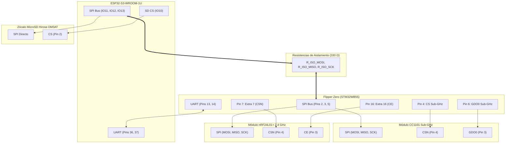

# Arquitectura de Conexión Canónica y Coexistencia Multi-Módulo en Flipper Zero
**Proyecto:** PulseLab / Flipper Killer MK II (ESP32-S3 + CC1101 + nRF24L01 + MicroSD)  
**Documento:** `docs/FLIPPER_ZERO_CANONICAL_PINOUT_AND_MULTIBOARD_COEXISTENCE.md`  
**Autor:** Antigravity & Tiny-Steward Pairing System  

---

## 1. Diagnóstico: ¿Por qué las conexiones previas no eran Plug & Play?

En versiones preliminares, el conector `J2` (cabezal GPIO de 18 pines del Flipper Zero) tenía asignaciones invertidas/arbitrarias (por ejemplo, `CS_CC1101` en Pin 2, `MISO` en Pin 5, `MOSI` en Pin 6, pines de masa 11 y 18 desconectados). 

Si se hubiese fabricado esa placa:
1. **Incompatibilidad Total con Apps Sub-GHz:** El firmware oficial de Flipper Zero tiene mapeado su periférico de hardware SPI exclusivamente en los pines STM32 `PA7 (Pin 2 / MOSI)`, `PA6 (Pin 3 / MISO)`, `PC3 (Pin 4 / CSN)` y `PA4 (Pin 5 / SCK)`.
2. **Falta de Masa Común:** Los pines 11 y 18 del Flipper quedaban flotantes sin unir al plano de masa general.

---

## 2. Pinout Canónico Universal del Cabezal GPIO del Flipper Zero (18 Pines)

A continuación se detalla la matriz de conexión estándar utilizada por firmwares como **Official**, **Unleashed**, **RogueMaster** y **Momentum**:

| Pin Flipper | Nombre / GPIO STM32 | Función Canónica | Conexión en Nuestra Placa (Flipper Killer MK II) |
| :---: | :---: | :---: | :--- |
| **Pin 1** | `+5V` (Alimentación) | Entrada/Salida 5V | `PWR_5V_FLIPPER_IN` (Al Diodo D1 BAT54C $\to$ AMS1117-3.3) |
| **Pin 2** | `PA7` (SPI1 MOSI / GPIO 2) | Bus SPI Datos Salida | **MOSI Compartido:** CC1101 (Pin 6) + nRF24 (Pin 6) + ESP32 (via `R_ISO_MOSI`) |
| **Pin 3** | `PA6` (SPI1 MISO / GPIO 3) | Bus SPI Datos Entrada | **MISO Compartido:** CC1101 (Pin 7) + nRF24 (Pin 7) + ESP32 (via `R_ISO_MISO`) |
| **Pin 4** | `PC3` (SPI1 CS / GPIO 4) | Chip Select Nativo | **`CS_RF_CC1101`** (Pin 4 CC1101) $\to$ **100% Plug & Play Sub-GHz** |
| **Pin 5** | `PA4` (SPI1 SCK / GPIO 5) | Bus SPI Reloj | **SCK Compartido:** CC1101 (Pin 5) + nRF24 (Pin 5) + ESP32 (via `R_ISO_SCK`) |
| **Pin 6** | `PB3` (GPIO 6) | GDO0 / CE | **`GDO0_RF_CC1101`** (Pin 3 CC1101) $\to$ **Paquetes y Asíncrono Sub-GHz** |
| **Pin 7** | `PC1` (GPIO 7 / Extra 7) | CS Secundario | **`CS_RF_NRF24`** (Pin 4 nRF24) $\to$ **Estándar 2-en-1 en Apps NRF24** |
| **Pin 8** | `GND` | Masa | Plano de Masa General (`PWR_GND`) |
| **Pin 9** | `+3.3V` (Alimentación) | Salida 3.3V Flipper | `PWR_3V3_FLIPPER` (Alimentación RF CC1101 + nRF24) |
| **Pin 10** | `PA14` (SWCLK) | Debug SWD | No conectado / Libre (`NC_SWC_10`) |
| **Pin 11** | `GND` | Masa | Plano de Masa General (`PWR_GND`) |
| **Pin 12** | `PA13` (SWDIO) | Debug SWD | No conectado / Libre (`NC_SIO_12`) |
| **Pin 13** | `PB6` (USART1 TX / GPIO 13) | Transmisión UART | `UART_ESP_RX` (Al Pin 36 RX del ESP32-S3 para Marauder/CLI) |
| **Pin 14** | `PB7` (USART1 RX / GPIO 14) | Recepción UART | `UART_ESP_TX` (Al Pin 37 TX del ESP32-S3 para Marauder/CLI) |
| **Pin 15** | `PC0` (GPIO 15 / Extra 15) | GPIO Extra | No conectado / Libre (`NC_GPIO15_15`) |
| **Pin 16** | `PB2` (GPIO 16 / Extra 16) | CE Secundario | **`CE_RF_NRF24`** (Pin 3 nRF24) $\to$ **Chip Enable para nRF24 Sniffer/Mousejack** |
| **Pin 17** | `PB14` (1-Wire / GPIO 17) | Bus iButton / 1-Wire | No conectado / Libre (`NC_1W_17`) |
| **Pin 18** | `GND` | Masa | Plano de Masa General (`PWR_GND`) |

---

## 3. Coexistencia Multi-Módulo (CC1101 + nRF24 + ESP32 + MicroSD)

### ¿Por qué esta topología es 100% Plug & Play?
1. **Sub-GHz Nativo (CC1101):** Sin configurar nada en el Flipper, cualquier app de Sub-GHz abre la comunicación en Pin 4 (CS) y Pin 6 (GDO0).
2. **nRF24L01 (Mousejack / Sniffer / BLE):** En los menús de configuración de Unleashed / RogueMaster, se selecciona `Pinout: Extra 7 / Extra 16` o `CS: Pin 7, CE: Pin 16`.
3. **ESP32 Marauder:** La app ESP32 WiFi Scanner / Marauder se conecta directamente al puerto serie de los Pines 13 y 14.
4. **Zócalo MicroSD:** Conectado directamente a las líneas de alta velocidad del ESP32-S3 (IO10/11/12/13), permitiendo volcar capturas PCAP y logs sin ralentizar el bus del Flipper.

---

## 4. Respuestas a los Problemas de Geometría y DRC

### 4.1. Zonas de Delimitación y Expansión del Contorno
* **Problema:** Al ampliar el contorno izquierdo a $X = 115.5\text{ mm}$, las zonas de delimitación no deben contener polígonos rellenos estáticos (`filled_polygon`), ya que estos representan bloques de cobre crudos que cortocircuitan pistas.
* **Solución:** Definir el perímetro de la zona `(polygon (pts (xy 114.0 81.0) ...))` cubriendo toda la extensión de la placa y dejar que KiCad calcule dinámicamente el vertido y los aislamientos térmicos de 0.20 mm.

### 4.2. Vías vs Agujeros No Metalizados (NPTH)
* **Distinción:** Las vías de paso (`via`) y los pines de componentes (`pad thru_hole`) son metalizados (PTH) y pertenecen a redes eléctricas. Los agujeros mecánicos de centrado del conector USB-C son no metalizados (`pad np_thru_hole`).
* **Aislamiento:** Los orificios NPTH se rigen por la regla `hole_to_copper_clearance` (0.25 mm) en lugar del aislamiento entre pistas. Configurar las reglas de forma homogénea elimina falsos positivos de DRC.
