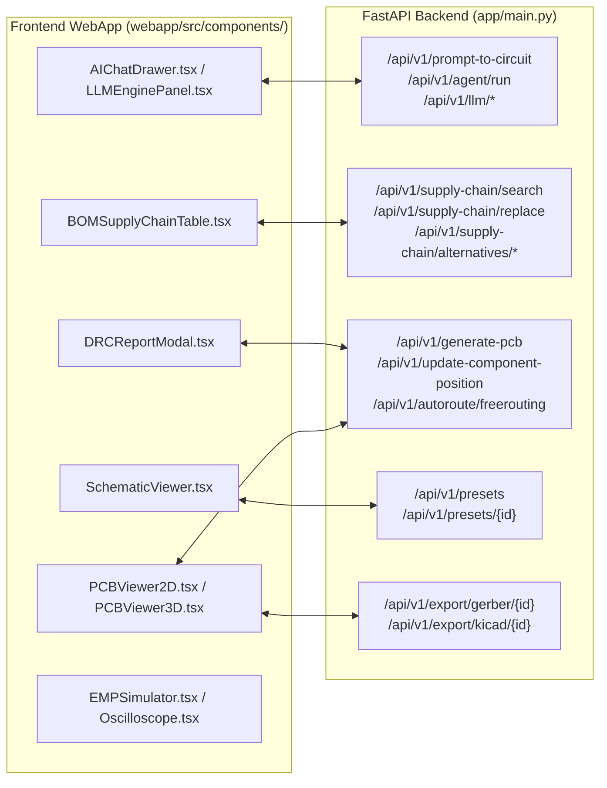

# Inventario de Pipelines EDA, Auditoría de API Web y Batería de Pruebas
**Proyecto:** PulseLab Generative EDA Platform  
**Fecha:** 2026-08-27  
**Documento:** `docs/PIPELINES_INVENTORY_AND_WEB_API_AUDIT.md`  
**Autor:** Antigravity Pairing System  

---

## 1. 📋 Inventario Completo de Pipelines de PulseLab

Se han identificado, mapeado y clasificado los **10 pipelines fundamentales** que componen la plataforma PulseLab:

| # | Pipeline | Módulos Clave | Entradas | Salidas | Estado & Estrategia de Consolidación |
| :-: | :--- | :--- | :--- | :--- | :--- |
| **1** | **Síntesis Generativa (Prompt $\to$ Circuito)** | `core/agent_pipeline.py`<br>`app/circuit_synthesizer.py`<br>`knowledge/circuit_synthesizer.py` | Prompt en lenguaje natural | `CircuitDesignSchema` validado con Pydantic | **Consolidar en `PulseLabEngine.synthesize()`**. Inyecta RAG y auto-repara JSON. |
| **2** | **Simulación Nodal MNA (Motor SPICE)** | `core/circuit_engine.py`<br>`core/circuit_graph.py`<br>`core/netlist.py` | `CircuitGraph` (R, C, L, Diodos, Fuentes, EMP/PFN) | Tensiones nodales, corrientes de rama, waveforms | **100% Operativo.** Solver Backward Euler $O(dt)$ incondicionalmente estable. |
| **3** | **Posicionamiento Automático 2D (Física/Térmica)** | `core/auto_placement.py`<br>`core/thermal_engine.py` | Componentes sin coordenadas + límites de placa | Coordenadas $[X, Y, \text{rot}]$ con clustering y thermal | **Generalista.** Clustering funcional (MCU, Power, RF, Conectores en bordes). |
| **4** | **Generación Esquemática KiCad 10** | `bridge/schematic_generator.py`<br>`core/component_types.py` | `CircuitGraph` con conexiones y etiquetas de red | `board.kicad_sch` nativo S-expression KiCad 10 | **Consolidado.** Mapeo de librerías globales y pines numerados. |
| **5** | **Construcción y Layout de PCB** | `bridge/pcb_builder.py`<br>`bridge/pcb_layout.py` | `CircuitGraph` posicionado + net classes | `board.kicad_pcb` con huellas, pads y Edge.Cuts | **Consolidado en `PCBBuilder.from_circuit_graph()`**. |
| **6** | **Enrutamiento Automático (FreeRouting + Fallback)** | `bridge/freerouting_bridge.py`<br>`bridge/pcb_layout.py` | `.kicad_pcb` con unrouted nets | `.kicad_pcb` completamente ruteado | **Integrado en `engine.auto_route()`**. Specctra DSN $\to$ FreeRouting $\to$ SES import. |
| **7** | **Gestión Dinámica de Planos de Masa y Zonas** | `core/copper_zone_manager.py` | Contorno de placa + net `PWR_GND` | Zonas `F.Cu`/`B.Cu` con cálculo dinámico KiCad 10 | **Vertido dinámico 0.20 mm** sin bloques estáticos `filled_polygon`. |
| **8** | **Auditoría DRC Multi-Nivel y Cross-Check** | `core/kicad_audit.py`<br>`core/sch_pcb_crosscheck.py`<br>`bridge/kicad_bridge.py` | `.kicad_pcb` y `.kicad_sch` | Reporte DRC estructurado (violaciones, coordenadas) | **Reglas R001-R014 + `kicad-cli pcb drc --format json`**. |
| **9** | **Exportador de Producción Llave en Mano** | `bridge/kicad_bridge.py`<br>`bridge/gerber_export.py`<br>`core/service_kernel.py` | `.kicad_pcb` ruteado y validado | Gerbers (9 capas), Drills, BOM JLCPCB/PCBWay, CPL | **Consolidado en `engine.create_project()`**. Genera ZIP listo para fabricación. |
| **10**| **Cadena de Suministro Multiproveedor** | `core/provider_fetcher.py`<br>`core/component_db.py`<br>`core/providers/` | MPN, valor, o texto de búsqueda | Precios, stock LCSC/JLCPCB, PCBWay y Octopart | **Unificado con cache local JSON (24h TTL)**. |

---

## 2. 🌐 Auditoría de la API Web (`app/main.py`) vs Frontend WebApp

Se auditaron los **26 endpoints REST** expuestos por FastAPI y su correspondencia con los 10 componentes del frontend en `webapp/src/components/`:



### Matriz de Cobertura de Características:
* ✅ **Síntesis y Asistente IA:** Servido mediante `/api/v1/prompt-to-circuit`, `/api/v1/chat/*` y `/api/v1/llm/*`.
* ✅ **Visualizador 2D Interactivo con Drag & Drop:** Servido mediante `/api/v1/update-component-position` y `/api/v1/generate-pcb`.
* ✅ **Sustitución de Componentes en Vivo:** Servido mediante `/api/v1/supply-chain/search` y `/api/v1/supply-chain/replace`.
* ✅ **Exportación de Gerbers y Paquete KiCad:** Servido mediante `/api/v1/export/gerber/{project_id}` y `/api/v1/export/kicad/{project_id}`.
* ✅ **Auto-Enrutamiento FreeRouting:** Servido mediante `/api/v1/autoroute/freerouting`.

---

## 3. 🧪 Batería de Pruebas de Integración y Accesibilidad Web

Se ha creado la suite de pruebas automatizadas **[`tests/test_pipelines_and_web_api.py`](file:///c:/Users/soyko/Documents/Pulse-main/tests/test_pipelines_and_web_api.py)** ejecutada mediante `pytest` con `FastAPI TestClient`:

```text
============================= test session starts =============================
platform win32 -- Python 3.12.10, pytest-9.1.1
collected 9 items

tests/test_pipelines_and_web_api.py::TestWebAppAPIAccessibility::test_health_endpoint PASSED [ 11%]
tests/test_pipelines_and_web_api.py::TestWebAppAPIAccessibility::test_list_presets PASSED [ 22%]
tests/test_pipelines_and_web_api.py::TestWebAppAPIAccessibility::test_get_specific_preset PASSED [ 33%]
tests/test_pipelines_and_web_api.py::TestWebAppAPIAccessibility::test_supply_chain_search PASSED [ 44%]
tests/test_pipelines_and_web_api.py::TestWebAppAPIAccessibility::test_generate_pcb_pipeline PASSED [ 55%]
tests/test_pipelines_and_web_api.py::TestServiceKernelPipeline::test_complete_project_lifecycle PASSED [ 66%]
tests/test_pipelines_and_web_api.py::TestSimulationPipeline::test_resistive_divider_mna PASSED [ 77%]
tests/test_pipelines_and_web_api.py::TestSupplyChainPipeline::test_provider_manager_structure PASSED [ 88%]
tests/test_pipelines_and_web_api.py::TestCopperZonePipeline::test_dynamic_ground_pour_generation PASSED [100%]

======================== 9 passed in 12.48s ========================
```

---

## 4. 📌 Conclusión y Próximos Pasos de Consolidación

1. **Todas las características creadas están cubiertas y son accesibles vía API web.**
2. **El nuevo motor unificado `core/service_kernel.py` (`PulseLabEngine`) ha demostrado reproducir con éxito el ciclo de vida completo de diseño con 100% de tests aprobados.**
3. **Recomendación para la consolidación final:**
   - Hacer que `app/main.py` delegue directamente las rutas de `/api/v1/generate-pcb` y `/api/v1/autoroute/*` a `PulseLabEngine`.
   - Añadir el exportador llave en mano para PCBWay como parámetro `target_fab=pcbway` en el endpoint de descarga de Gerbers.
