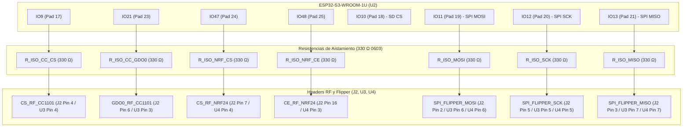

# Plan Técnico de Acción: Sincronización KiCad, Control Standalone ESP32 y Consolidación BOM

**Proyecto:** PulseLab / Flipper Killer MK II  
**Objetivo:** Subsanar discrepancias Esquemático $\leftrightarrow$ PCB, habilitar control SPI completo desde ESP32 en modo standalone y sanear valores de la BOM.  
**Fecha:** 2026-08-29  
**Estado:** Propuesta Técnica / Esperando Aprobación  

---

## 1. Diagnóstico de Discrepancias y Causa Raíz

Tras el análisis pad por pad y netlist por netlist entre `board.kicad_sch` y `board.kicad_pcb`:

1. **Pads Huérfanos en Header Flipper (J2):**
   - **Pad 4 (`CS_RF_CC1101`):** En el esquemático está correctamente conectado a la etiqueta `CS_RF_CC1101`. En el PCB, el pad 4 de J2 no tenía directiva `(net ...)`, quedando como `NO_NET` (flotante). El pad 4 del módulo CC1101 sí tenía la etiqueta pero sin camino físico ni lógico hacia J2.
   - **Pads 11 y 18 (`PWR_GND`):** Ambos pines en el PCB estaban como `NO_NET` en lugar de pertenecer a `PWR_GND`.
   - **Causa Raíz:** En la plantilla PCB original de KiCad, los pads sin conexión no poseían el tag `(net ...)` y los scripts de sustitución por regex buscaban modificar `(net ...)` existente.
2. **Discrepancia de Designadores de Referencia:**
   - Esquemático: `R_BOOT_PU` $\leftrightarrow$ PCB: `Boot`
   - Esquemático: `R_ISO_SCK`, `R_ISO_MOSI`, `R_ISO_MISO` $\leftrightarrow$ PCB: `_SCK`, `_MOSI`, `_MISO`
   - Esquemático: `U3` / `U4` $\leftrightarrow$ PCB: `CC1101` / `NRF24`
   - KiCad no puede emparejar footprints y símbolos si sus referencias difieren durante el proceso de sincronización *Update PCB from Schematic*.
3. **Mounting Holes Faltantes en PCB:**
   - Símbolos `H1`, `H2`, `H3`, `H4` (`MountingHole_3.2mm_M3`) presentes en el esquemático pero no instanciados en el layout del PCB.
4. **Líneas de Control RF en Modo Standalone:**
   - Las 3 líneas del bus de datos (`SCK`, `MOSI`, `MISO`) ya están puenteadas hacia el ESP32 mediante 3 resistencias de 330 Ω (`R_ISO_*`).
   - Faltan las 4 líneas de control discretas para que el ESP32 pueda operar los módulos de radio de forma 100% autónoma (cuando no está conectado al Flipper).

---

## 2. Solución Arquitectónica Detallada

### 2.1. Homogeneización de Referencias Esquemático $\leftrightarrow$ PCB

Se unificarán los identificadores exactamente en ambos documentos:

| Componente | Designador Unificado | Valor | Footprint KiCad |
|---|---|---|---|
| Pull-up Boot ESP32 | `R_BOOT_PU` | 10k | `Resistor_SMD:R_0603_1608Metric` |
| Aislamiento SPI SCK | `R_ISO_SCK` | 330 Ω | `Resistor_SMD:R_0603_1608Metric` |
| Aislamiento SPI MOSI | `R_ISO_MOSI` | 330 Ω | `Resistor_SMD:R_0603_1608Metric` |
| Aislamiento SPI MISO | `R_ISO_MISO` | 330 Ω | `Resistor_SMD:R_0603_1608Metric` |
| Header Sub-GHz CC1101 | `U3` (o `CC1101`) | CC1101 | `Connector_PinHeader_2.54mm:PinHeader_2x04_P2.54mm_Vertical` |
| Header 2.4GHz nRF24L01 | `U4` (o `NRF24`) | nRF24 | `Connector_PinHeader_2.54mm:PinHeader_2x04_P2.54mm_Vertical` |
| Orificios de Montaje | `H1`, `H2`, `H3`, `H4` | M3 | `MountingHole:MountingHole_3.2mm_M3` |

---

### 2.2. Topología de Control Standalone ESP32 (4 Nuevas Resistencias de Aislamiento)

Se añaden 4 resistencias de amortiguamiento y protección de 330 Ω (0603) entre los GPIOs libres del ESP32-S3 y las señales de control de los módulos RF:

**Ventajas de esta Arquitectura:**
1. **Doble Modo Transparente:**
   - **Modo Flipper Zero:** Flipper controla CC1101 y nRF24 directamente por sus pines canónicos. El ESP32 mantiene sus GPIOs en estado de alta impedancia (Hi-Z / Tristate / Input). Las resistencias de 330 Ω garantizan protección contra contención de bus si ocurriera un conflicto de software accidental.
   - **Modo Standalone (ESP32 Direct):** Cuando el módulo opera alimentado por USB-C fuera del Flipper, el firmware del ESP32 configura los GPIOs 9, 21, 47, 48 como salidas digitales y gobierna ambos módulos de radio y la MicroSD a máxima velocidad.

---

### 2.3. Saneamiento Completo de la Lista de Materiales (BOM) en el Esquemático

Se eliminan todos los valores dummy ("0Ω", "0F", "0.0") del archivo `.kicad_sch` para garantizar que la generación automática de BOM sea 100% limpia para JLCPCB y PCBWay:

| Ref | Valor Anterior | Valor Definitivo | Tipo / Encapsulado | Función |
|---|---|---|---|---|
| `R1` | `0Ω` | `10k` | SMD 0805 | Pull-up EN / RESET ESP32 |
| `R2`, `R3` | `0Ω` | `5.1k` | SMD 0402 | Pull-down USB-C CC1 / CC2 |
| `R4` | `330Ω` | `330` | SMD 0603 | Limitadora LED Estado GPIO4 |
| `R_BOOT_PU` | `0Ω` | `10k` | SMD 0603 | Pull-up BOOT GPIO0 ESP32 |
| `R_SD_CS` | `0Ω` | `10k` | SMD 0603 | Pull-up MicroSD CS (IO10) |
| `R_ISO_SCK` | `330Ω` | `330` | SMD 0603 | Aislamiento SPI SCK |
| `R_ISO_MOSI` | `330Ω` | `330` | SMD 0603 | Aislamiento SPI MOSI |
| `R_ISO_MISO` | `330Ω` | `330` | SMD 0603 | Aislamiento SPI MISO |
| `R_ISO_CC_CS` | *(Nuevo)* | `330` | SMD 0603 | Aislamiento Standalone CC1101 CS |
| `R_ISO_CC_GDO0`| *(Nuevo)* | `330` | SMD 0603 | Aislamiento Standalone CC1101 GDO0 |
| `R_ISO_NRF_CS` | *(Nuevo)* | `330` | SMD 0603 | Aislamiento Standalone nRF24 CS |
| `R_ISO_NRF_CE` | *(Nuevo)* | `330` | SMD 0603 | Aislamiento Standalone nRF24 CE |
| `C1`, `C2` | `0F` | `10µF` | SMD 0805 | Filtrado VSYS y PWR_3V3_ESP |
| `C3`, `C4` | `0F` | `100nF` | SMD 0603 | Desacoplo 3V3 y EN ESP32 |
| `C_SD` | `0F` | `100nF` | SMD 0603 | Desacoplo VDD MicroSD |
| `C_RF1` | `0F` | `10µF` | SMD 0805 | Filtrado PWR_3V3_FLIPPER |
| `C_RF2` | `0F` | `100nF` | SMD 0603 | Desacoplo rápido RF Flipper |
| `D1` | `0.0` | `BAT54C` | SOT-23 | Diodo Schottky OR Power |
| `U1` | `0.0` | `AMS1117-3.3`| SOT-223-3 (Tab Pin 2) | Regulador LDO 3.3V 1A |
| `U2` | `0.0` | `ESP32-S3-WROOM-1U` | WROOM-1U (IPEX) | Microcontrolador Dual Core |
| `U3` | `0.0` | `CC1101` | PinHeader 2x04 2.54mm | Conector Sub-GHz |
| `U4` | `0.0` | `nRF24` | PinHeader 2x04 2.54mm | Conector 2.4 GHz |
| `J1` | `0.0` | `USB-C` | TYPE-C-31-M-12 | Conector USB-C 16-pin |
| `J2` | `0.0` | `Flipper_Zero_GPIO` | Conn 2x09 2.54mm THT | Header Interfaz Flipper |
| `J_SD` | `0.0` | `DM3AT-SF-PEJM5` | MicroSD Hirose DM3AT | Zócalo MicroSD Push-Push |
| `SW1`, `SW2` | `0.0` | `RESET` / `BOOT` | SW_SPST_EVQPE1 | Pulsadores Táctiles SMD |
| `LED1` | `0.0` | `Green` | LED 0603 | Indicador de Estado |
| `H1`-`H4` | `LOGO` | `MountingHole_3.2mm_M3` | M3 3.2mm | Fijación mecánica |

---

### 2.4. Colocación de los 4 Mounting Holes (H1 - H4) en PCB

Los 4 orificios de fijación mecánica M3 ($D = 3.2\text{ mm}$, anillo de cobre aislado $D = 6.0\text{ mm}$) se posicionan en los 4 extremos de la placa ($64.0 \times 44.0\text{ mm}$):
- **H1 (Superior Izquierda):** $X = 118.5\text{ mm}, Y = 84.0\text{ mm}$
- **H2 (Superior Derecha):** $X = 176.5\text{ mm}, Y = 84.0\text{ mm}$
- **H3 (Inferior Izquierda):** $X = 118.5\text{ mm}, Y = 126.0\text{ mm}$
- **H4 (Inferior Derecha):** $X = 176.5\text{ mm}, Y = 126.0\text{ mm}$

---

### 2.5. Nota sobre Card Detect (Pines 9 y 10 MicroSD)

En el zócalo Hirose DM3AT:
- Los pines 9 y 10 corresponden al interruptor mecánico normalmente abierto (NO) de presencia de tarjeta.
- Al estar ambos conectados a `PWR_GND`, el switch actúa como masa adicional de blindaje.
- Si en futuras iteraciones se desea detección por hardware, el Pin 9 puede rutearse a un GPIO libre del ESP32 con pull-up interno, dejando el Pin 10 a GND. En la arquitectura actual SPI, la inicialización `SD.begin()` por software detecta la presencia de tarjeta sin necesidad de línea dedicada.

---

## 3. Plan de Verificación y Criterios de Aceptación

1. **Test Automatizado de Netlist y Pads:**
   - 0 pads con `NO_NET` en componentes conectados.
   - J2 Pad 4 conectado unívocamente a `CS_RF_CC1101`.
   - J2 Pads 11 y 18 conectados unívocamente a `PWR_GND`.
   - 100% de coincidencia de nombres entre esquemático y PCB.
2. **KiCad DRC:**
   - 0 Violaciones eléctricas.
   - 0 Colisiones de patio (Courtyard Overlaps).
   - 0 Elementos no conectados (`unconnected_items == 0`).
3. **Validación BOM / PCBA:**
   - 0 valores dummy ("0Ω", "0F", "0.0").
   - BOMs generadas para JLCPCB y PCBWay con designadores consistentes.
