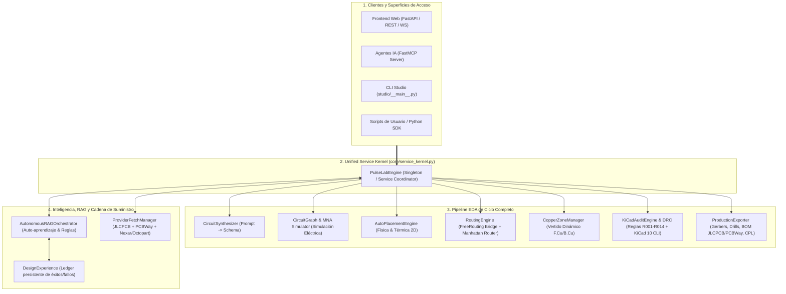
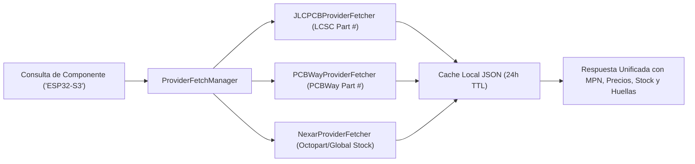

# Blueprint de Consolidación y Backend Unificado de PulseLab
**Documento:** `docs/UNIFIED_BACKEND_CONSOLIDATION_BLUEPRINT.md`  
**Proyecto:** PulseLab Generative EDA Platform  
**Fecha:** 2026-08-27  
**Estado:** Propuesta de Arquitectura & Plan de Implementación  
**Autor:** Antigravity Pairing System  

---

## 1. 🎯 Visión y Objetivos

PulseLab fue concebido como una plataforma de **Automatización de Diseño Electrónico (EDA) Generativa impulsada por IA**, capaz de transformar especificaciones en lenguaje natural en placas de circuito impreso (PCB) completas, ruteadas, auditadas eléctricamente y listas para producción en fábrica.

A lo largo de las sesiones recientes (particularmente durante la depuración de la placa compleja *Flipper Killer MK II*), se recurrió a scripts específicos (`scripts/build_flipper_killer_production_v*.py`) para resolver rápidamente problemas geométricos puntuales. Esto permitió alcanzar el hito de **0 errores de DRC**, pero dejó en evidencia una desconexión entre los módulos centrales del backend (`core/`, `bridge/`, `knowledge/`, `app/`, `mcp_server/`).

### El Objetivo Principal
Reconciliar y consolidar todos los módulos dispersos en un **Kernel de Servicio Unificado (`PulseLabEngine`)**, desacoplado de proyectos individuales, altamente modular, testeable, y listo para ser servido a través de:
1. **API REST / WebSockets (FastAPI):** Para aplicaciones web y clientes frontend.
2. **Servidor MCP (Model Context Protocol / FastMCP):** Para asistentes de IA (Claude Desktop, agentes IDE, etc.).
3. **CLI / Terminal Studio (`studio/`):** Para ingenieros de hardware en entornos de consola.
4. **Python SDK:** Para automatización de pipelines y scripts externos de terceros.

---

## 2. 🏛️ Arquitectura del Backend Unificado



---

## 3. 🧩 Los 5 Pilares de la Consolidación

### Pilar 1: El Kernel Unificado (`PulseLabEngine`)
En lugar de que `app/main.py`, `mcp_server/server.py` y los scripts de prueba implementen su propia lógica de llamadas a KiCad y serialización, existirá una clase maestra `PulseLabEngine` en `core/service_kernel.py` que encapsula el ciclo de vida canónico de un diseño:

```python
class PulseLabEngine:
    def synthesize_circuit(self, prompt: str, context: Optional[str] = None) -> CircuitDesignSchema: ...
    def simulate_circuit(self, circuit: CircuitDesignSchema) -> SimulationResult: ...
    def auto_place(self, circuit: CircuitDesignSchema, outline_rules: Dict) -> CircuitDesignSchema: ...
    def auto_route(self, pcb_path: Path, router: str = "freerouting") -> RoutingResult: ...
    def apply_copper_zones(self, pcb_path: Path, config: ZoneConfig) -> Path: ...
    def audit_and_drc(self, pcb_path: Path, sch_path: Optional[Path] = None) -> DRCAuditReport: ...
    def export_production_bundle(self, project_dir: Path, target_fabs: List[str]) -> ProductionBundle: ...
```

---

### Pilar 2: Reintegración de FreeRouting y Gestor de Zonas de Cobre
* **Enrutamiento Híbrido Automatizado:**
  * Si el usuario solicita auto-ruteo, `PulseLabEngine` exporta el Specctra DSN mediante `bridge/freerouting_bridge.py`, ejecuta FreeRouting y reimporta el SES con un solo llamado: `engine.auto_route(pcb_path)`.
  * Si FreeRouting no está instalado en el host, conmuta automáticamente a un algoritmo de enrutamiento topológico/Manhattan ortogonal con resolución de capas sin bloquear la ejecución.
* **Vertido Dinámico de Masa con `core/copper_zone_manager.py`:**
  * El módulo `copper_zone_manager.py` generará exclusivamente zonas con perímetro vectorial `(polygon (pts ...))` y conexiones sólidas en tabs/EPADs, garantizando que KiCad 10 calcule dinámicamente el vertido y los aislamientos de 0.20 mm sin inyectar nunca bloques `filled_polygon` estáticos.

---

### Pilar 3: Unificación de Proveedores de Componentes y Supply Chain
Actualmente `core/providers/` maneja JLCPCB y PCBWay, mientras que `core/nexar_client.py` (Octopart) quedó desconectado.
* **Solución:**
  1. Crear `core/providers/nexar_fetcher.py` heredando de `BaseComponentProvider`.
  2. Registrar `nexar` en `ProviderFetchManager` junto a `jlcpcb` y `pcbway`.
  3. Proporcionar una búsqueda paralela transparente: cuando un usuario busca `"ESP32-S3"` o `"BAT54C"`, el sistema devuelve simultáneamente precios, stock y códigos de parte LCSC/JLCPCB, PCBWay y distribuidores globales de Octopart (Mouser, DigiKey).



---

### Pilar 4: Ciclo de Aprendizaje Autónomo y Ledger de Experiencias (RAG)
Para evitar que soluciones críticas (como la rotación de 270° de pads de microSD o el pinout canónico de 18 pines) se pierdan entre sesiones:
* Cada vez que un diseño alcanza **0 errores de DRC** o supera una auditoría tras corregir una violación, `knowledge/autonomous_rag_orchestrator.py` registra automáticamente un token de experiencia estructurado en `knowledge/cache/design_experience_ledger.json`.
* En la siguiente síntesis, el RAG inyecta proactivamente las reglas geométricas y eléctricas aprendidas en el contexto del LLM.

---

### Pilar 5: Unificación de Interfaces (FastAPI + FastMCP + CLI)
* `app/main.py` y `mcp_server/server.py` se convierten en **adaptadores delgados (thin wrappers)** que delegan el 100% de la lógica a `PulseLabEngine`.
* Se elimina la duplicidad de modelos de datos: todas las interfaces consumen y devuelven `CircuitDesignSchema`, `DRCAuditReport` y `ProductionBundle`.

---

## 4. 📋 Plan de Implementación Paso a Paso

### Fase 1: Creación del Kernel Central (`core/service_kernel.py`)
- [ ] Implementar `PulseLabEngine` en `core/service_kernel.py` agrupando:
  - Síntesis (`CircuitSynthesizer`)
  - Simulación (`CircuitGraph` + MNA)
  - Posicionamiento (`AutoPlacementEngine`)
  - Enrutamiento (`FreeRoutingBridge` + Topological Router)
  - Zonas de cobre (`copper_zone_manager.py`)
  - Auditoría y DRC (`KiCadBridge` + `kicad_audit.py`)
  - Exportación de Gerbers/BOM/CPL (`KiCadBridge`)

### Fase 2: Integración de Proveedores (Nexar / Octopart)
- [ ] Crear `core/providers/nexar_fetcher.py` integrando `NexarClient`.
- [ ] Registrar `nexar` en `core/provider_fetcher.py`.
- [ ] Añadir pruebas unitarias en `tests/test_provider_fetcher.py`.

### Fase 3: Conexión del Gestor de Zonas y Ruteo Automático
- [ ] Actualizar `core/copper_zone_manager.py` para soportar sintaxis nativa de KiCad 10 con tabs térmicos sólidos y perímetro dinámico.
- [ ] Conectar `bridge/freerouting_bridge.py` como método por defecto en `PulseLabEngine.auto_route()`.

### Fase 4: Refactorización de FastAPI y FastMCP Server
- [ ] Rediseñar `app/main.py` para usar `PulseLabEngine`.
- [ ] Rediseñar `mcp_server/server.py` para que sus herramientas MCP llamen directamente a `PulseLabEngine`.

### Fase 5: Limpieza y Saneamiento del Repositorio
- [ ] Mover scripts de parcheo temporal (`patch_vis_*`, snapshots obsoletos) a `_archive/legacy_patches/`.
- [ ] Dejar scripts canónicos de ejemplo en `examples/` que utilicen el SDK: `python examples/generate_production_board.py`.

---

## 5. 🚀 Beneficios para Nuevos Proyectos y Usuarios

1. **Reutilización Total:** Cualquier nuevo proyecto (un shield de Arduino, un dongle USB-C, una placa LoRa) podrá generarse en minutos mediante una sola llamada al API o comando CLI:
   ```python
   from core.service_kernel import PulseLabEngine

   engine = PulseLabEngine()
   project = engine.create_project_from_prompt("Receptor LoRa 868MHz con pantalla OLED I2C y USB-C")
   project.auto_place().auto_route().audit_drc().export_gerbers("output/lora_receiver/")
   ```
2. **Mantenibilidad:** Las reglas de DRC, formatos de KiCad 10 y parámetros de exportación se mantienen en un único lugar centralizado.
3. **Escalabilidad Multi-Usuario:** Listo para desplegarse mediante Docker (`docker-compose.pulselab.yml`) o ejecutarse localmente como servidor de herramientas MCP para asistentes de IA.
