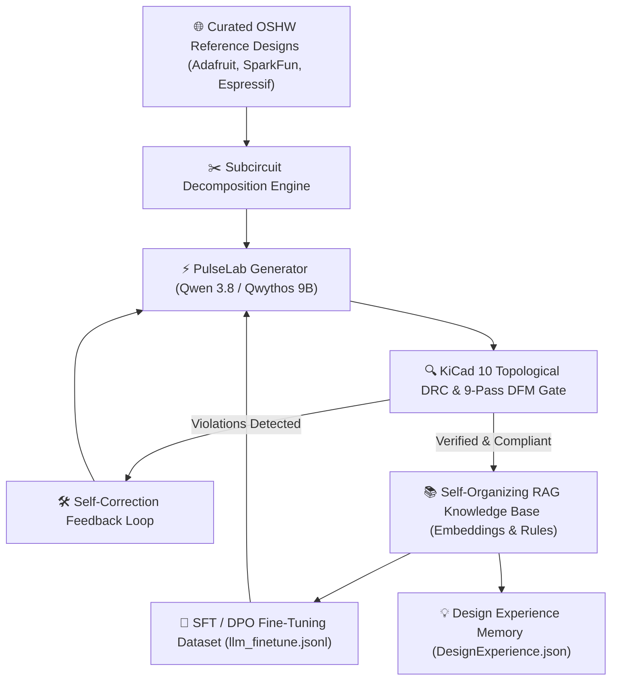

# PulseLab EDA — Autonomous Learning Curriculum & Self-Organizing RAG Architecture

**Version:** 2.1 • Self-Evolving Hardware Intelligence  
**Target Backends:** Qwen 3.8 9B Distill, Qwythos 9B, Gemma 4 12B, Tiny-Steward

---

## 1. Executive Vision: The Autonomous EDA Learning Loop

To elevate our electronic design models from static prompt generators to **autonomous, self-evolving hardware designers**, PulseLab implements a closed-loop **Self-Organizing RAG & Continuous Curriculum Learning** engine.



---

## 2. Tiered Hardware Exercise Curriculum (The "Gym")

This progressive curriculum trains and benchmarks the model on essential electronic building blocks, advancing from discrete power supplies to complex multi-layer wireless systems.

### Tier 1: Foundational Power, Timing & Analog Blocks
| ID | Title | Core Focus | Critical Verification Rules |
| :--- | :--- | :--- | :--- |
| `t1_ex01` | **AMS1117-3.3 5V $\rightarrow$ 3.3V LDO Rail** | Linear Regulation & Decoupling | $C_{in} \ge 10\mu\text{F}$, $C_{out} \ge 22\mu\text{F}$ for loop damping; 5.1k$\Omega$ pull-downs on USB-C CC1/CC2 pins. |
| `t1_ex02` | **NE555 Astable LED Flasher** | RC Timing & Multivibrators | 100nF bypass on Pin 5 (Control Voltage); threshold/discharge junctions tied correctly. |
| `t1_ex03` | **USB-C Input ESD & Polarity Protection** | Transient Protection | USBLC6-2SC6 ESD clamp on $D+/D-$; Schottky flyback diode across inductive inputs. |
| `t1_ex04` | **N-Channel MOSFET Low-Side Switch** | High-Current Switching | 100$\Omega$ gate damping resistor; 10k$\Omega$ pull-down on gate to ensure default OFF state. |

---

### Tier 2: Microcontrollers, Busses & Digital Sensors
| ID | Title | Core Focus | Critical Verification Rules |
| :--- | :--- | :--- | :--- |
| `t2_ex01` | **ESP32-WROOM-32 Minimal System** | MCU Minimal Support & Boot | EN pin RC delay ($10\text{k}\Omega + 1\mu\text{F}$); GPIO0 boot button; zero copper beneath PCB antenna. |
| `t2_ex02` | **RP2040 Dual-Core Minimal Circuit** | Multi-Rail Power & QSPI | 1.1V Core regulator (VREG); 100nF per VDD pin; 133MHz QSPI Flash with 27$\Omega$ series damping. |
| `t2_ex03` | **BME280 Environmental Sensor Node** | I2C Bus & Level Shifting | 4.7k$\Omega$ pull-ups on SDA/SCL; CSB tied to 3.3V for I2C selection; 100nF low-ESR bypass. |
| `t2_ex04` | **WS2812B Addressable RGB LED Chain** | Fast Digital Timing & Power | 1000$\mu\text{F}$ bulk capacitor across 5V rail; 330$\Omega$ series resistor on DIN data pin to prevent ringing. |

---

### Tier 3: Complex Embedded Systems & High-Current Actuators
| ID | Title | Core Focus | Critical Verification Rules |
| :--- | :--- | :--- | :--- |
| `t3_ex01` | **NEMA17 Stepper Driver (A4988)** | Inductive Loads & Motor Drive | 100$\mu\text{F}$ 25V low-ESR electrolytic capacitor adjacent to VMOT pin; $\ge 0.50\text{mm}$ power traces. |
| `t3_ex02` | **ESP32-S3 Handheld Gaming Console** | High-Speed SPI & I2S Audio | 40MHz SPI display lines routed short; audio DAC power filtered via ferrite bead + 10$\mu\text{F}$. |
| `t3_ex03` | **TP4056 LiPo Battery Charging Circuit** | Battery Management & Safety | PROG resistor sets charge current ($1.2\text{k}\Omega = 1\text{A}$); thermal vias under IC exposed pad. |
| `t3_ex04` | **4-Layer Microcontroller PCB Stackup** | High-Speed Layout & EMI | Layer 2 continuous GND reference plane; Layer 3 Power/Traces; 50$\Omega$ controlled RF impedance. |

---

## 3. Curated Open-Source Reference Repositories (The Golden Dataset)

These industry-standard repositories provide verified, production-proven KiCad schematics and layouts for training and RAG ingestion:

1. **Adafruit Open-Source Hardware Collection**
   * *Repositories:* `Adafruit-ESP32-S3-Feather-PCB`, `Adafruit-RP2040-Feather-PCB`, `Adafruit-BME280-Breakout-PCB`
   * *License:* Creative Commons Attribution / Share-Alike
   * *Highlights:* High-density component placement, robust power protection, clean KiCad 7/8/9 hierarchical schematics.

2. **SparkFun Electronics Open Hardware Library**
   * *Repositories:* `Pro_Micro_RP2040`, `Qwiic_Sensor_Hub`, `SparkFun_MicroMod`
   * *License:* Open Source Hardware (OSHW)
   * *Highlights:* Standardized I2C (Qwiic) bus layouts, power sequencing, compact form-factors.

3. **Raspberry Pi Official Hardware Design Guides**
   * *Reference Designs:* RP2040 Minimum Design Example (KiCad), Raspberry Pi Pico Reference Layout.
   * *Highlights:* 4-layer stackups, crystal oscillator routing, USB impedance matching.

4. **Espressif Systems Hardware Design Guidelines**
   * *Reference Designs:* ESP32-WROOM-32E DevKit, ESP32-S3-Korvo.
   * *Highlights:* RF layout, antenna ground keepouts, flash/PSRAM decoupling.

---

## 4. Self-Organizing RAG Architecture (Self-Learning Mechanics)

The orchestrator in [`knowledge/autonomous_rag_orchestrator.py`](file:///C:/Users/soyko/Documents/Pulse-main/knowledge/autonomous_rag_orchestrator.py) implements three automated self-learning mechanisms:

### Mechanism A: Automated Subcircuit & Pattern Ingestion
When a KiCad project is ingested:
1. The schematic parser isolates functional clusters ($V_{in} \rightarrow \text{Regulator} \rightarrow V_{out}$, $\text{MCU} \rightarrow \text{Crystals/Decoupling}$).
2. Each cluster is summarized into a schema pattern in `knowledge/pattern_library.json`.
3. Vector embeddings are generated with `nomic-embed-text` and stored in `knowledge/data/embeddings/vectors.npy`.

### Mechanism B: Dynamic DRC Rule Harvesting & Experience Memory
When the model generates a circuit during interactive synthesis or self-play:
1. PulseLab runs KiCad 10 Topological DRC (`core/kicad_audit.py`).
2. If an error is detected and corrected (e.g. *Missing decoupling on ESP32 pin 2*), a rule record is automatically formulated:
   ```json
   {
     "rule_title": "ESP32_Pin2_Decoupling_Requirement",
     "category": "Power_Integrity",
     "rule_text": "ESP32-WROOM-32 3V3 power input (Pin 2) must have a 100nF ceramic capacitor placed within 3mm."
   }
   ```
3. The rule is ingested into the live RAG vector store (`ElectronicsKnowledgeBase.ingest_text()`) and saved in [`knowledge/experiences/`](file:///C:/Users/soyko/Documents/Pulse-main/knowledge/experiences).

### Mechanism C: Synthetic SFT / DPO Fine-Tuning Pipeline
1. Validated circuits and their step-by-step reasoning traces are compiled into ChatML / Qwen 3.8 XML format (`<think>...</think>`, `<tool_call>...`).
2. Stored in [`knowledge/data/llm_finetune.jsonl`](file:///C:/Users/soyko/Documents/Pulse-main/knowledge/data/llm_finetune.jsonl).
3. Used for periodic local LoRA / QLoRA fine-tuning using [`knowledge/finetune_circuit_llm.py`](file:///C:/Users/soyko/Documents/Pulse-main/knowledge/finetune_circuit_llm.py).

---

## 5. How to Run Autonomous Self-Play Exercises

You can trigger exercise simulations and ingest rules with the Python orchestrator:

```python
from knowledge.autonomous_rag_orchestrator import autonomous_rag_orchestrator

# 1. Run a Tier 1 simulation exercise (e.g. AMS1117 LDO)
result = autonomous_rag_orchestrator.run_exercise_simulation("t1_ex01_ams1117_ldo")
print(f"Exercise Passed: {result['drc_passed']}, Lessons Ingested: {len(result['lessons_learned'])}")

# 2. Ingest custom hardware rules directly into RAG
autonomous_rag_orchestrator.ingest_rule(
    rule_title="USB-C CC Pull-Down Requirement",
    rule_text="Standard USB-C Upstream Facing Ports (UFP) require two separate 5.1k pull-down resistors on CC1 and CC2 to GND.",
    category="USB_Design"
)
```
