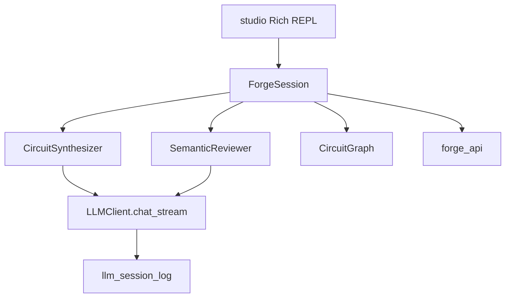

# Forge Studio — Headless LLM Debug Shell

**Status:** Completed (Session 4e, 07-jul-2026)  
**Last verified:** 2026-07-07  
**See also:** [`index.md`](./index.md) · [`../status/CURRENT_SPRINT.md`](../status/CURRENT_SPRINT.md) · [`../architecture/APP_ARCHITECTURE.md`](../architecture/APP_ARCHITECTURE.md)

---

## Domain

**Forge Studio** is a headless adjunct presentation layer for interactive LLM debugging during circuit synthesis and semantic review. It does not replace `pulse_lab.py`; it runs as a separate process (`python -m studio`) for developers calibrating the Calibration Forge pipeline.

| Layer | Package | Responsibility |
|-------|---------|----------------|
| Presentation | `studio/` | Rich REPL, slash commands, live token display |
| Orchestration | `studio/session.py` | Session state, graph, delegates to agents |
| Knowledge | `knowledge/` | LLM transport, agents, RAG, session logs |
| Bridge | `bridge/forge_api.py` | PCB/schematic export (no pygame) |
| Core | `core/circuit_graph.py` | Circuit data model |



## Dependency rules

- `studio/` **must not** import `ui/` or `pygame`
- `knowledge/` **must not** import `studio/`
- LLM features degrade gracefully when Ollama is down
- No `OPENAI_API_KEY` required for v1 (Ollama native streaming)

## v1 scope

**In scope:**

- `python -m studio` Rich REPL with live thinking/content streams (qwythos-9b-96k)
- Slash commands: `/generate`, `/review`, `/backends`, `/save`, `/load`, `/schematic`, `/session`, `/quit`
- Shared `session_id` across all LLM calls in one REPL session
- Pin coverage summary after generation (via `validate_complex_apps._pin_coverage`)

**Out of scope (deferred):**

- Pygame modal integration
- Web canvas / React Forge Studio
- Vision / Qwythos mmproj image input
- Inline schematic viewer (v1 prints SVG path only)

## Windows terminal requirements

1. Use **Windows Terminal** (not legacy conhost)
2. Before launch: `$env:PYTHONIOENCODING='utf-8'`
3. Studio calls `sys.stdout.reconfigure(encoding='utf-8', errors='replace')` at startup
4. Output uses ASCII tags (`[thinking]`, `[content]`, `[done]`) — no emoji in core paths

## Usage

```powershell
$env:PYTHONIOENCODING='utf-8'
python -m studio
python -m studio --backend primary
```

Example session:

```
studio> /backends
studio> Diseña un ESP32 con BME280 en I2C
studio> /review
studio> /schematic
studio> /save output/studio_circuit.json
```

## Sprint alignment

Shares LLM transport with **Session 4c** (`chat_stream`, `done_reason`, `history`). Does not block Session 4b A/B — but 4b should still wait for 4c P0 guardrails per sprint order.

## Vision (future research)

Qwythos supports mmproj for image input (Qwen3.5-9B vision tower). Future work: rasterize schematic SVG to PNG, pass via Ollama `images` field, pair with deterministic pin-coverage guards.

---

## Resultado

**Session 4e — 07-jul-2026**

Implemented Forge Studio CLI v1:

| Deliverable | Path |
|-------------|------|
| Studio package | `studio/` (`__main__.py`, `session.py`, `commands.py`, `stream_ui.py`, `preview.py`) |
| LLM streaming transport | `knowledge/llm_types.py`, `knowledge/ollama_native.py::chat_native_stream`, `knowledge/llm_client.py::chat_stream` |
| Agent streaming hooks | `on_chunk` on `CircuitSynthesizer.generate_circuit_json`, `SemanticReviewer.review_netlist` |
| Tests | `tests/test_ollama_native_stream.py`, `tests/test_studio_session.py` (10 new tests, no live Ollama) |
| Dependency | `rich>=13,<14` in `requirements.txt` |

**Usage:** `$env:PYTHONIOENCODING='utf-8'; python -m studio`

**Deferred:** web canvas, pygame modal streaming, vision/mmproj.

**Session closed:** 07-jul-2026 — README, `docs/README.md`, `FORGE_STATUS.md`, `APP_ARCHITECTURE.md`, and `index.md` synced.

**Windows smoke test:** manual — requires Ollama `:11431` + `qwythos-9b-96k` + Windows Terminal.
