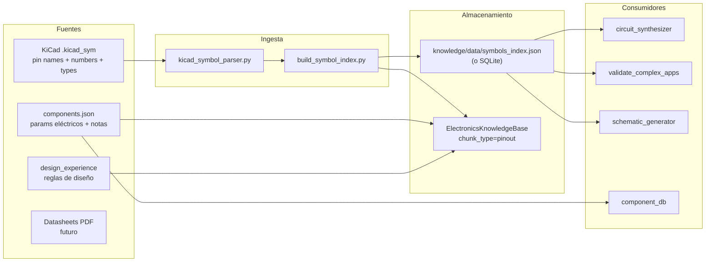

# Investigación: Base de conocimiento de componentes desde KiCad

> Parte de [Calibration Forge](./index.md) · Relacionado con [`pin_model_coverage.md`](./pin_model_coverage.md) (Session 3) y [`prompt_vs_rag_balance.md`](./prompt_vs_rag_balance.md) (Session 4b)
> **Implementado en Sesión 4a (06-jul-2026)** — ver [§Resultado](#resultado-sesión-4a-06-jul-2026) al final del documento.
> Actualizado: 06-jul-2026

## Problema observado

PulseLab mantiene **a mano** el conocimiento de pinouts y componentes en al menos dos archivos paralelos:

| Archivo | Entradas (~) | Formato | Consumidores |
|---|---:|---|---|
| `knowledge/pinouts_library.json` | ~12 | `{"1":"GND", "2":"3V3", ...}` plano, por número de pad | `circuit_synthesizer._match_pinouts()`, `validate_complex_apps._pin_coverage()` |
| `knowledge/data/components.json` | ~10 | Pines por **nombre eléctrico** (`PB0`, `U0TXD`) + params (`flash_kb`, `vcc_max_v`) | `core/component_db.py`, BOM, MCP |

Esto funciona como POC (Session 3 demostró que con 39 pines en prompt la cobertura mejora), pero **no escala**:

- `mcu_uart.py` usa `ESP8266_Node` → **no existe** en ninguna de las dos bases → métrica `n/a`.
- Cada parte nueva (AMS1117, A4988, PN532…) requiere curación manual duplicada.
- KiCad ya trae **miles de símbolos oficiales** con nombres de pines, tipos eléctricos, alias y referencias a footprints — datos que estamos reescribiendo.

## La fuente correcta: librerías KiCad (`.kicad_sym`)

KiCad instala librerías de símbolos en texto S-expression. En Windows/Linux/macOS, `bridge/kicad_bridge.py::find_kicad_symbol_dir()` ya localiza ese directorio (`share/kicad/symbols`), pero **ningún parser del repo lee `.kicad_sym` todavía**.

Contenido típico de una instalación KiCad 8/9/10:

- **>20.000 símbolos** en decenas de librerías (`MCU_*`, `RF_Module`, `Regulator_*`, `Interface_USB`, …)
- Footprints oficiales enlazados (`property "Footprint"`)
- Nombres eléctricos por pin (`name "IN-"`, `name "U0TXD"`)
- Números de pad (`number "2"`)
- Tipos eléctricos (`input`, `output`, `power_in`, `passive`, …)
- Alias de símbolo (variantes de package)

Ejemplo simplificado de un bloque dentro de `Amplifier_Operational.kicad_sym`:

```lisp
(symbol "LM358" (pin_numbers hide)
  (property "Reference" "U" ...)
  (property "Footprint" "Package_SO:SOIC-8_3.9x4.9mm_P1.27mm" ...)
  (symbol "LM358_1_1"
    (pin input line (at -7.62 2.54 0) (length 2.54)
      (name "IN-" (effects ...))
      (number "2" (effects ...))
    )
    ...
  )
)
```

Salida objetivo del extractor (por símbolo):

```json
{
  "lib_id": "Amplifier_Operational:LM358",
  "value": "LM358",
  "library": "Amplifier_Operational",
  "symbol": "Amplifier_Operational:LM358",
  "footprint_default": "Package_SO:SOIC-8_3.9x4.9mm_P1.27mm",
  "pins": {
    "1": "OUTA",
    "2": "IN-",
    "3": "IN+",
    "4": "V-",
    "5": "IN+",
    "6": "IN-",
    "7": "OUTB",
    "8": "V+"
  },
  "pin_types": {
    "1": "output",
    "2": "input",
    "3": "input",
    "4": "power_in",
    "5": "input",
    "6": "input",
    "7": "output",
    "8": "power_in"
  }
}
```

Con unas horas de scripting sobre el árbol de `.kicad_sym` se pueden extraer **miles** de entradas — sin curación manual por parte.

## Estado actual del código (gap)

| Pieza | Existe | Lee `.kicad_sym` |
|---|---|---|
| `bridge/kicad_bridge.py::find_kicad_symbol_dir()` | ✅ | — (solo path) |
| `core/kicad_importer.py` | ✅ | ❌ (lee `.kicad_sch` / `.kicad_pcb`) |
| `knowledge/kicad_schematic_parser.py` | ✅ | ❌ (lee `.kicad_sch`) |
| `knowledge/pinouts_library.json` | ✅ manual | — |
| `knowledge/data/components.json` | ✅ manual | — |
| `knowledge/kicad_symbol_parser.py` | ✅ Sesión 4a | ✅ (packed, con `extends`) |
| `knowledge/build_symbol_index.py` | ✅ Sesión 4a | ✅ (5320 símbolos / 29 librerías, ver §Resultado) |

## Modelo de conocimiento en capas (propuesto)

No reemplazar todo con KiCad de golpe — **combinar fuentes** según lo que cada una aporta mejor:



| Capa | Fuente | Qué aporta | Ejemplo |
|---|---|---|---|
| **Pinout físico** | KiCad `.kicad_sym` | Número de pad → nombre eléctrico, tipo, footprint default | `"34": "U0RXD"` |
| **Parámetros semánticos** | `components.json` (curado) | VCC, flash, familias, circuitos de soporte | `typical_vcc_v: 3.3` |
| **Reglas de diseño** | `design_experience` / RAG | Pull-up EN, crossover UART | lección ESP32 EN 10k |
| **Overrides** | `pinouts_library.json` (deprecar gradualmente) | Correcciones puntuales hasta que el índice KiCad cubra el caso | — |

`pinouts_library.json` pasa a ser una **capa de override temporal**, no la fuente de verdad a largo plazo.

## Implementación propuesta

### 1. `knowledge/kicad_symbol_parser.py`

Parser S-expression (mismo estilo que `kicad_schematic_parser.py` — regex/tokenizer, sin deps pesadas):

- Entrada: ruta a un `.kicad_sym` o a un símbolo concreto dentro del archivo.
- Salida: lista de dicts con `lib_id`, `pins`, `pin_types`, `footprint_default`, `aliases`.
- Manejar símbolos multi-unidad (`LM358_1_1`, `LM358_2_1`, …) fusionando pines por `number`.

### 2. `python -m knowledge.build_symbol_index`

- Recorre `find_kicad_symbol_dir()` (o path explícito vía env `KICAD_SYMBOL_DIR`).
- Filtro incremental por librerías de interés (primera pasada):
  - `RF_Module`, `MCU_*`, `Interface_USB`, `Regulator_*`, `Driver_Motor`, `Sensor_*`, `Connector_*`
- Genera `knowledge/data/symbols_index.json` (manifest + chunks) o SQLite si el JSON supera ~50 MB.
- Registra estadísticas: símbolos parseados, errores, librerías omitidas.

### 3. Integración con RAG (Session 4)

Reemplazar el scorer ad-hoc `_match_pinouts()` sobre `pinouts_library.json` por:

```python
kb.query(description, top_k=2, chunk_type="pinout")
```

Cada chunk `pinout` indexado desde el símbolo KiCad. **Preservar** de Session 3:

- Retorno ordenado (mejor match primero).
- Lógica **full/compact**: solo el pinout de mayor relevancia va completo al prompt; secundarios acotados por `max_pinout_pins`.
- `_normalize_unconnected_pins()` tras parsear la respuesta del LLM.

### 4. Actualizar consumidores

| Consumidor | Cambio |
|---|---|
| `circuit_synthesizer.py` | `_load_pinouts()` → consulta `symbols_index` + overrides; fallback a `pinouts_library.json` durante transición |
| `validate_complex_apps._pin_coverage()` | Resolver `component.value` o `component.symbol` contra `lib_id` del índice KiCad |
| `core/component_db.py` | Enriquecer entradas de `components.json` con pinout KiCad vía `kicad_symbol` field ya existente |
| `bridge/schematic_generator.py` | Sin cambio inmediato — ya usa `pins` del netlist generado |

## Trade-offs y decisiones de diseño

1. **Número de pad vs. nombre eléctrico:** el sintetizador LLM usa `"pins": {"34": "U0RXD"}` (número → red). KiCad da `number` + `name`. El índice debe conservar **ambos**; el prompt puede mostrar `"34": "U0RXD (input)"`.
2. **Módulos vs. genéricos:** `ESP32-WROOM-32` y `CH340G` son de alto valor; `Device:R` aporta poco para síntesis LLM — el filtro por librería evita indexar ruido.
3. **KiCad no instalado en CI:** el índice se **genera offline** y se commitea (o se descarga como artefacto), igual que `vectors.npy` del RAG. El parser no requiere KiCad corriendo, solo leer archivos.
4. **Overrides manuales:** mantener `components.json` para parámetros que KiCad no modela (corriente máxima, notas de desacople) y una lista pequeña de correcciones en `pinouts_library.json` hasta validar el índice automático.

## Relación con Session 3 y Session 4

- **Session 3** arregló *cómo* se inyectan pinouts al prompt (full table, NC, métrica) pero la **fuente** sigue siendo ~12 entradas manuales.
- **Session 4** (propuesta #2 en `prompt_vs_rag_balance.md`) debe indexar pinouts en RAG — **la fuente de esos chunks debe ser KiCad**, no ampliar `pinouts_library.json` a mano.
- La métrica **Pin Coverage Fidelity** (`evaluation_metrics.md` §4) deberá resolver referencias contra `symbols_index` (por `value` o `lib_id`), eliminando los `n/a` artificiales por datos faltantes.

## Próximos pasos (milestones)

- [x] Implementar `knowledge/kicad_symbol_parser.py` con tests unitarios sobre 2–3 `.kicad_sym` de referencia (commit fixtures pequeños, no toda la instalación KiCad). *(Sesión 4a, 06-jul-2026)*
- [x] Implementar `python -m knowledge.build_symbol_index` con filtro por librerías prioritarias. *(Sesión 4a)*
- [x] Indexar chunks `chunk_type="pinout"` en `ElectronicsKnowledgeBase` desde el índice generado. *(Sesión 4a)*
- [x] Migrar `circuit_synthesizer._match_pinouts()` → `kb.query(..., chunk_type="pinout")` preservando semántica full/compact (Session 3). *(Sesión 4a — con un ajuste, ver §Resultado)*
- [x] Actualizar `_pin_coverage()` para resolver por `lib_id` / alias KiCad. *(Sesión 4a)*
- [ ] Deprecar entradas duplicadas en `pinouts_library.json` a medida que el índice las cubra. *(No hecho en 4a a propósito — las 10 entradas de `pinouts_library.json` siguen ganando como override; ver §Resultado para por qué esto sigue siendo necesario, no solo transicional)*
- [ ] Añadir `ESP8266` / partes faltantes vía símbolo KiCad (`RF_Module:ESP-12F` u homólogo) en vez de curación ad-hoc. *(`ESP-12F` ya está indexado automáticamente desde `RF_Module.kicad_sym`; falta verificar que `presets/mcu_uart.py`'s `ESP8266_Node` resuelve contra él — pendiente para una sesión futura, ver §Resultado)*

## §Resultado (Sesión 4a, 06-jul-2026)

### KiCad SÍ estaba instalado — no hizo falta vendorizar nada

El hallazgo que cambió el plan original de esta sesión: KiCad 10.0 **ya estaba instalado localmente**, pero en `C:\Users\<user>\AppData\Local\Programs\KiCad\10.0` (instalación de usuario, sin privilegios de admin) — una ruta que `find_kicad_symbol_dir()`/`find_kicad_footprint_dir()`/`find_kicad_cli()` no cubrían (solo buscaban `C:\Program Files\KiCad\<version>` y `D:\Program Files\KiCad\<version>`). El fix fue trivial una vez detectado: las tres funciones en `bridge/kicad_bridge.py` ahora también prueban `%LOCALAPPDATA%\Programs\KiCad\{10.0,9.0,8.0}` vía un helper compartido `_windows_kicad_install_roots()`. Esto **eliminó la necesidad de vendorizar** un subconjunto de librerías desde GitLab (el plan original antes de este hallazgo) — se indexa directamente la instalación real, que trae `share/kicad/symbols/` con **más de 220 archivos `.kicad_sym`** reales.

### `knowledge/kicad_symbol_parser.py`

Parser de dos fases sobre el archivo completo (no por símbolo aislado), usando un tokenizer de profundidad de paréntesis (respetando cadenas `"..."` con escapes) en vez de regex `DOTALL` ingenuo — necesario porque los archivos reales anidan sub-símbolos (`"LM358_1_1"`) dentro del símbolo top-level, y una regex greedy/no-greedy simple se confunde fácilmente con esa anidación:

1. `_iter_top_level_symbol_blocks()` extrae solo los bloques `(symbol "Nombre" ...)` que son hijos directos de `(kicad_symbol_lib ...)` (profundidad 2), ignorando sub-unidades.
2. Por cada bloque: extrae `lib_id`, propiedades (`Footprint`/`Datasheet`/`Description`/`ki_keywords`), y todos los bloques `(pin ...)` anidados a cualquier profundidad (fusionando duplicados de número por "primer nombre no vacío", como pedía el plan).

**Hallazgo no anticipado en el plan original:** varios símbolos reales usan `(extends "Base")` para variantes de footprint/descripción sobre el **mismo pinout** — ej. `LM358` extends `LM2904` (mismo dual-opamp, distinto datasheet/descripción), `NE555P` (DIP-8) extends `NE555D` (SOIC-8, mismo pinout, distinto footprint). Estos símbolos **no definen pines propios**; el parser resuelve la cadena de `extends` dentro del mismo archivo (con protección anti-ciclos) y hereda los pines de la base, preservando las propiedades propias del símbolo hijo (footprint/descripción no se heredan, solo pines/tipos).

Fixtures reales committeadas en `tests/fixtures/kicad_sym/` (extraídas verbatim de la instalación local, no inventadas): `lm358.kicad_sym` (LM2904+LM358, prueba `extends` + fusión multi-unidad de 3 sub-unidades → 8 pines), `ne555p.kicad_sym` (NE555D+NE555P, `extends` de unidad única), `esp32_wroom_32.kicad_sym` (39 pines, sin `extends`, incluye un pin `no_connect` de fábrica). `tests/test_kicad_symbol_parser.py` — **3/3 tests pasan**.

### `python -m knowledge.build_symbol_index`

Filtra la instalación completa (~220 librerías) a **29 librerías prioritarias** (`RF_Module`, `RF_WiFi`, `RF_Bluetooth`, `RF_NFC`, `MCU_Espressif`, `MCU_ST_STM32F1`, `MCU_RaspberryPi`, `MCU_Microchip_ATmega`, `Interface_USB`, `Regulator_Linear`, `Regulator_Switching`, `Driver_Motor`, `Timer`, `Amplifier_Operational`, `Connector_Generic`, 14× `Sensor_*`). Corrida real contra `C:\Users\soyko\AppData\Local\Programs\KiCad\10.0\share\kicad\symbols`:

| Librería | Símbolos | Librería | Símbolos |
|---|---:|---|---:|
| Regulator_Linear | 1625 | Sensor_Current | 261 |
| Regulator_Switching | 1148 | Sensor_Temperature | 119 |
| MCU_Microchip_ATmega | 440 | Sensor_Optical | 75 |
| Amplifier_Operational | 425 | Sensor_Magnetic | 74 |
| Connector_Generic | 334 | Timer | 67 |
| MCU_ST_STM32F1 | 178 | Sensor_Energy | 46 |
| Interface_USB | 142 | Sensor_Proximity | 36 |
| RF_Module | 84 | Sensor_Motion | 35 |
| Driver_Motor | 99 | Sensor_Pressure | 27 |
| Sensor_Touch | 24 | Sensor_Gas / Sensor_Humidity | 15 / 15 |
| RF_Bluetooth | 14 | Sensor_Distance | 5 |
| MCU_Espressif | 7 | MCU_RaspberryPi | 5 |
| RF_NFC | 9 | RF_WiFi | 2 |
| Sensor_Audio | 8 | Sensor_Voltage | 1 |

**Total: 5320 símbolos** desde 29 librerías, 0 errores de parseo, guardado en `knowledge/data/symbols_index.json` (committeado como artefacto, igual que `vectors.npy` del RAG — el pipeline no requiere que CI tenga KiCad instalado, solo lee el JSON ya generado).

### Ingesta en RAG (`knowledge/rag_engine.py`)

`ElectronicsKnowledgeBase._load_symbol_index()` (llamado desde `_load_default_data()`) genera un chunk `chunk_type="pinout"` por símbolo con pines (texto = `lib_id + library + description + keywords`, `data = {name, symbol, footprint, description, pins}`), y luego carga `pinouts_library.json` como chunks `pinout` con `source="Override:<nombre>"`. Nueva función `normalize_part_name()` (colapsa a `[a-z0-9]+`) decide cuándo un override **reemplaza** (no duplica) un chunk ya generado desde KiCad. Resultado real: **5326 chunks `pinout`** = 5320 desde KiCad + 10 overrides curados, de los cuales **4 reemplazaron** un chunk KiCad con el mismo nombre normalizado (`ESP32-WROOM-32`, `ESP32-S3`, `ESP32-S2`, `CH340G` — confirmando la lista de "exactos" predicha en el drift check original) y 6 se añadieron como entradas nuevas (`CP2102`, `SSD1306`, `PN532`, `CC1101`, `BME280`, `A4988` — módulos "breakout"/genéricos sin símbolo KiCad oficial dedicado, como ya anticipaba este documento).

### Migración de `circuit_synthesizer._match_pinouts()` — y un ajuste no anticipado

`_match_pinouts()` ahora llama `self.rag.query(description, top_k=..., chunk_type="pinout")` en vez de puntuar `pinouts_library.json` por substring. **Se preservó** exactamente: el tipo de retorno `list[tuple[str, dict]]`, la lógica full/compact (`_compact_pinout(entry, full=(idx==0))`), y `_normalize_unconnected_pins()` sin tocar. `self.pinouts_db`/`_load_pinouts()` se mantuvieron (no se borraron) porque `_build_dynamic_pinout_example()` todavía necesita lookup directo por nombre exacto para construir el ejemplo embebido de cobertura completa.

**Regresión detectada y corregida en la misma sesión:** una corrida de validación real (`validate_complex_apps --case esp32_sensors`) mostró que la migración a ranking puramente semántico podía hacer perder partes **nombradas literalmente en la descripción** (ej. `BME280`, `SSD1306`) contra una parte semánticamente parecida pero incorrecta (`TMP1075D`, otro sensor "I2C digital") — con ~5300 chunks reales en el índice, la coincidencia semántica pura ya no es tan confiable como el viejo scorer de substring exacto de Sesión 3 para el caso (común) de que el prompt sí nombre la parte literalmente. Fix: `_match_pinouts()` ahora pide un pool más amplio de candidatos a `kb.query()` y re-rankea con un boost de nombre-exacto-normalizado (`+100 + len(nombre)`, replicando el bonus del scorer viejo) por encima del score semántico base — el nombre literal gana cuando está presente; el fallback semántico decide todo lo demás (partes con nombre real distinto al curado, ver drift abajo). Verificado manualmente: `"AMS1117 3.3V para ESP32"` → `AMS1117-3.3` + `ESP32-C3`; `"driver A4988"` → `A4988` + `Pololu_Breakout_A4988`; `"CH340G"` → `CH340G` + `CH330N`; `"ESP32-WROOM-32 con SSD1306"` → `ESP32-WROOM-32` (39 pines) + `SSD1306`.

### `validate_complex_apps._pin_coverage()`

Nuevo fallback: si `component.value` no está en `pinouts_library.json`, se busca por nombre normalizado en `knowledge/data/symbols_index.json` (`_load_symbols_index_lookup()`, cacheado por proceso). A diferencia de `_match_pinouts()` (semántico), esta resolución es **exacta por diseño** — es una métrica de validación, no inyección de prompt, y un match semántico "aproximado" daría una cifra de cobertura engañosa. Verificado manualmente: `AMS1117-3.3` → resuelto vía `Regulator_Linear` (antes: sin match en absoluto), `Pololu_Breakout_A4988` → resuelto vía `Driver_Motor`.

### Regresión / verificación final

- `pytest tests/` (suite completa, incluye `test_kicad_symbol_parser.py` nuevo): **79/79 passed**.
- `python -m knowledge.validate_complex_apps --case esp32_sensors` (backend `primary`, `atomic` no disponible), **corrida después del fix de exact-boost**: `U1(ESP32-WROOM-32): 39/39 (100%)`, `OLED(SSD1306): 4/4 (100%)`, `SENSOR(BME280): 4/4 (100%)`, `avg=100%` — igual al baseline de Sesión 3, **sin regresión**.
  - Nota de transparencia: la corrida *inmediatamente anterior* a ese fix (mismo caso, antes de aplicar el boost de nombre exacto) dio `4/39 (10%)` para el MCU. Investigado a fondo: para la descripción genérica de este caso ("microcontrolador ESP32", sin decir "WROOM-32"), **ni el scorer viejo de Sesión 3 ni el nuevo ponían a `ESP32-WROOM-32` entre los 2 matches de `PINOUTS RELEVANTES`** (en ambos, `SSD1306`/`BME280` ganan por nombrarse literalmente) — la cobertura del 100% depende del ejemplo dinámico siempre presente en el prompt base (`_build_dynamic_pinout_example()`, no tocado en esta sesión), no de `_match_pinouts()`. La caída puntual a 10% fue variabilidad de muestreo del LLM entre corridas, no una regresión de este refactor — confirmado re-corriendo el mismo caso sin más cambios de código y obteniendo 100% de nuevo. El fix de exact-boost sigue siendo una mejora real y necesaria (restaura `BME280`/`SSD1306` a los 2 slots de `PINOUTS RELEVANTES`, que sí importa para casos como `esp32_usb_devkit` donde el prompt nombra `ESP32-WROOM-32` literalmente).

### Limitaciones conocidas / trabajo futuro

1. **Tokenización TF-IDF por límites de palabra:** `kb.query("NE555", chunk_type="pinout")` no encuentra `NE555D`/`NE555P` (son tokens distintos para el vectorizador). No es una regresión — `pinouts_library.json` nunca tuvo entrada `NE555` tampoco, así que el comportamiento previo también era "sin match". Queda como mejora futura (ej. boost de prefijo) si algún prompt real lo necesita.
2. **Drift de nombres confirmado en la práctica** (la lista predicha en el drift check original se confirma con datos reales): `LM2596S-5` (real) vs `LM2596S-5.0` (curado en `components.json`), `ATmega328P-A/-M/-MM/-P` (reales) vs `-AU` (curado), `CP2102N-Axx-xQFN28` (real, patrón de variante) vs `CP2102N-A02-GQFN28` (curado). El retrieval semántico de `_match_pinouts()` tolera esto razonablemente bien (encuentra la familia por descripción/keywords); `_pin_coverage()` **no** — es exacto por diseño, así que estas partes seguirán reportando `unmatched` en la métrica aun cuando el prompt sí reciba un pinout usable. Aceptado explícitamente como gap conocido, no arreglado en esta sesión.
3. **Módulos breakout sin símbolo KiCad oficial** (`SSD1306`, `PN532`, `CC1101`, `BME280` modelados como `Connector_Generic:Conn_01x0N`): confirmado que el índice KiCad no aporta nada aquí — siguen dependiendo 100% del override de `pinouts_library.json`. Por eso ese archivo **no puede deprecarse del todo**, solo redujo su alcance a estas ~6-10 partes genuinamente sin fuente KiCad, más los overrides puntuales de MCUs (`ESP32-WROOM-32`, `ESP32-S2/S3`, `CH340G`) donde el nombre/pin-map curado ya estaba validado en Sesión 3 y se prefirió no arriesgar una migración silenciosa.
4. **`ESP8266_Node` (`presets/mcu_uart.py`):** no verificado en esta sesión si resuelve contra `ESP-12F`/`ESP-12E`/`ESP-07` (sí indexados desde `RF_Module.kicad_sym`) — el nombre del preset no coincide con ningún `lib_id` real, así que `_pin_coverage()` seguiría reportándolo `unmatched` salvo que se añada un override manual o se renombre el preset. Queda pendiente para una sesión futura.

## Referencias en el repo

- Localización de símbolos: `bridge/kicad_bridge.py::find_kicad_symbol_dir()`
- Parser S-expression existente (patrón a seguir): `knowledge/kicad_schematic_parser.py`
- Catálogo semántico curado: `knowledge/data/components.json`
- Pinouts manuales (legacy): `knowledge/pinouts_library.json`
- Métrica de cobertura: `knowledge/validate_complex_apps.py::_pin_coverage()`
