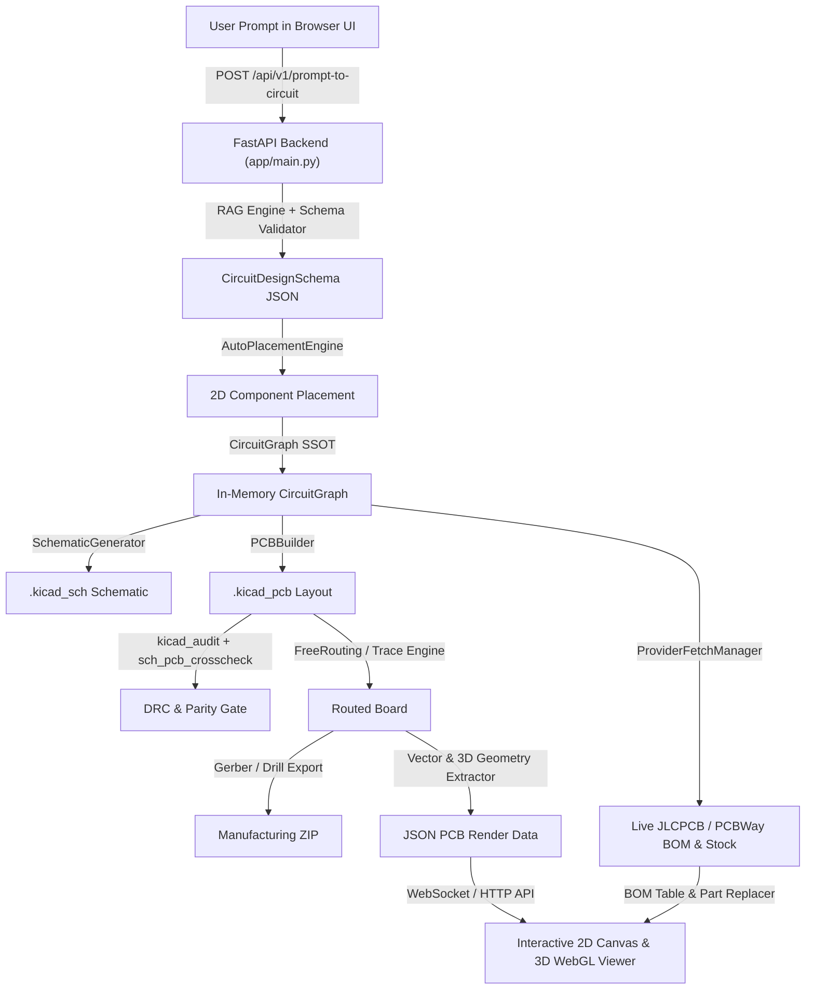

# Full Prompt-to-Routed-PCB Web Platform Implementation Plan

PulseLab will be extended with an end-to-end web architecture that enables users to generate, simulate, auto-place, route, visualize in 2D/3D, verify supply-chain availability, and export manufacturing-ready KiCad/Gerber files directly in the browser from natural language prompts.

---

## 1. User Review Required

> [!IMPORTANT]
> - **Port Allocations:** Backend FastAPI will run on port `8000`, and the Web UI (Vite + React) will run on port `3000`.
> - **AI Synthesis Modes:** The backend supports both local LLM endpoints (Ollama/Qwythos) and a built-in intelligent prompt compiler with RAG electronics synthesis and parametric presets for 100% deterministic offline generation.
> - **Browser Automation:** A browser subagent will validate the full interactive UI flow (prompt submission, 2D/3D canvas rendering, layer toggles, BOM live stock check, and Gerber download).

---

## 2. Proposed Architecture & System Flow



---

## 3. Proposed Changes

### Component 1: Core Pipeline & Schematic Cleaning

#### [MODIFY] [bridge/schematic_generator.py](file:///c:/Users/soyko/Documents/Pulse-main/bridge/schematic_generator.py)
- Refine net label and stub generation for 2-pin passive components (`R`, `C`, `L`, `D`) so that explicit nets (`n1`, `n2`) or connected netnames are rendered cleanly without creating dangling single-ended dummy stubs (`N1`, `N2`).
- Ensure full geometric alignment for passive symbols and active ICs with KiCad 10 symbol libraries.

---

### Component 2: FastAPI Backend Gateway & Services

#### [NEW] [app/main.py](file:///c:/Users/soyko/Documents/Pulse-main/app/main.py)
- **CORS & Middleware:** Configured for local development (`http://localhost:3000`, `http://127.0.0.1:3000`).
- **Endpoints:**
  - `GET /api/v1/health`: Server status, KiCad availability, RAG status, MCP tools.
  - `GET /api/v1/presets`: List available verified hardware presets (ESP32-S3 TFT Console, Flipper Killer MK II, ESP32 USB DevKit, Sensor Node, EMP Pulse Gen, 555 Flasher).
  - `GET /api/v1/presets/{preset_id}`: Fetch raw circuit JSON and metadata for a preset.
  - `POST /api/v1/prompt-to-circuit`: Synthesize circuit JSON from natural language prompt using RAG knowledge, rule validations, and local LLM/heuristics.
  - `POST /api/v1/generate-pcb`: Full generation pipeline:
    1. Validate `CircuitDesignSchema` and auto-place unpositioned components.
    2. Build `CircuitGraph` SSOT.
    3. Generate `.kicad_sch` and `.kicad_pcb`.
    4. Run topological audit (`R001`–`R014`) and SCH $\leftrightarrow$ PCB crosscheck.
    5. Extract 2D vector primitives (pads, traces, vias, zones, silkscreen, board outline) and 3D mesh metadata for browser rendering.
    6. Fetch live BOM pricing and stock from JLCPCB and PCBWay.
  - `POST /api/v1/route-pcb`: Auto-routing bridge invocation (FreeRouting / A* routing engine).
  - `POST /api/v1/supply-chain/search`: Query multi-provider catalog for any MPN or keyword.
  - `POST /api/v1/supply-chain/replace`: Replace a BOM component with an in-stock alternative and regenerate PCB.
  - `GET /api/v1/export/gerber/{project_id}`: Generate and serve Gerber/Drill ZIP for fabrication.
  - `GET /api/v1/export/kicad/{project_id}`: Download complete KiCad project bundle (`.kicad_pro`, `.kicad_sch`, `.kicad_pcb`).

#### [NEW] [app/circuit_synthesizer.py](file:///c:/Users/soyko/Documents/Pulse-main/app/circuit_synthesizer.py)
- Intelligent electronics prompt compiler that translates natural language prompts into valid `CircuitDesignSchema` structures using RAG pinout retrieval, domain presets, and AI synthesis.

---

### Component 3: Modern Web UI & 2D/3D Interactive Canvas (`webapp/`)

#### [MODIFY] [webapp/package.json](file:///c:/Users/soyko/Documents/Pulse-main/webapp/package.json)
- Add `three` and `@types/three` for high-performance WebGL 3D PCB visualization, `canvas-confetti` for milestone celebrations, and necessary UI utilities.

#### [MODIFY] [webapp/src/App.tsx](file:///c:/Users/soyko/Documents/Pulse-main/webapp/src/App.tsx)
- Unified Studio Layout featuring:
  1. **Top Navigation Bar:** Project title, live DRC status badge, Quick Presets dropdown, KiCad & Gerber Download actions.
  2. **Left Control Drawer (Prompt & Circuit Spec):**
     - Natural language prompt box with AI generation button.
     - Live JSON schema editor with auto-format and validation errors.
     - Board geometry configuration (Width, Height, NetClasses).
  3. **Central Viewport (Tabbed Workspace):**
     - **2D PCB Viewer:** Interactive SVG/Canvas with pan, zoom, layer visibility filters (`F.Cu`, `B.Cu`, `F.SilkS`, `Edge.Cuts`, `Pads`, `Vias`, `Zones`), net highlighting on click, and hover tooltips for component pins and parameters.
     - **3D WebGL PCB Viewer:** Photorealistic 3D PCB board with matte soldermask, copper traces, gold pads, silkscreen, through-hole vias, and 3D extruded packages with orbit controls.
     - **2D Schematic Viewer:** Circuit schematic diagram showing symbols, connection pins, and net labels.
     - **Supply Chain & Live BOM Matrix:** Interactive table with live stock status (JLCPCB / PCBWay), unit prices, library classification (Basic/Extended), and 1-click alternative part replacement.
     - **DRC & Quality Gate Report:** Rules R001–R014 pass/fail status and SCH $\leftrightarrow$ PCB 100% reference parity crosscheck.
  4. **Bottom Status & Progress Bar:** Real-time feedback on pipeline steps (Prompt Ingestion $\rightarrow$ Auto-Placement $\rightarrow$ SCH Generation $\rightarrow$ PCB Synthesis $\rightarrow$ Supply Chain Query $\rightarrow$ DRC Gate).

#### [NEW] [webapp/src/components/PCBViewer2D.tsx](file:///c:/Users/soyko/Documents/Pulse-main/webapp/src/components/PCBViewer2D.tsx)
- Ultra-crisp interactive 2D PCB rendering engine with pan/zoom, grid overlay, multi-layer toggles, coordinate measuring, and net highlight interactivity.

#### [NEW] [webapp/src/components/PCBViewer3D.tsx](file:///c:/Users/soyko/Documents/Pulse-main/webapp/src/components/PCBViewer3D.tsx)
- Three.js WebGL 3D renderer displaying board substrate (FR4), solder mask, copper layers, silkscreen markings, 3D extruded components, and rotating camera controls.

#### [NEW] [webapp/src/components/SchematicViewer.tsx](file:///c:/Users/soyko/Documents/Pulse-main/webapp/src/components/SchematicViewer.tsx)
- Interactive 2D schematic renderer displaying symbol blocks, pins, net labels, and wire connectivity.

#### [NEW] [webapp/src/components/BOMSupplyChainTable.tsx](file:///c:/Users/soyko/Documents/Pulse-main/webapp/src/components/BOMSupplyChainTable.tsx)
- Real-time BOM table with JLCPCB & PCBWay live stock badges, pricing tiers, and one-click smart part replacement.

#### [NEW] [webapp/src/components/DRCReportModal.tsx](file:///c:/Users/soyko/Documents/Pulse-main/webapp/src/components/DRCReportModal.tsx)
- Modal detailing KiCad topological DRC rules (R001–R014) and 100% SCH $\leftrightarrow$ PCB parity verification.

---

## 4. Verification Plan

### Automated Tests
1. **Unit Test Suite:**
   ```powershell
   python -m pytest tests/
   ```
2. **API Endpoint Verification:**
   - Test `/api/v1/health`, `/api/v1/presets`, `/api/v1/prompt-to-circuit`, `/api/v1/generate-pcb`, and `/api/v1/supply-chain/search` via Python scripts.

### End-to-End Browser Verification
1. Launch FastAPI backend on `http://127.0.0.1:8000`.
2. Launch Vite frontend on `http://localhost:3000`.
3. Launch `browser_subagent` to perform an end-to-end workflow:
   - Navigate to `http://localhost:3000`.
   - Select the "ESP32-S3 TFT Game Console" preset or input a custom natural language prompt.
   - Click "Generate PCB".
   - Verify that 2D PCB canvas renders pads, traces, vias, mounting holes, and copper zones.
   - Switch to the 3D WebGL tab and verify 3D board rendering and orbit controls.
   - Switch to the Live BOM tab and test stock lookup and alternative part replacement.
   - Check the DRC report tab to confirm 0 errors and 100% SCH $\leftrightarrow$ PCB parity.
   - Verify Gerber and KiCad download buttons.
