# PulseLab Forge — Revisión técnica semanal (18 julio 2026)

> **Role:** review (point-in-time)  
> **Status:** active narrative  
> **Reviewer posture:** Strict supervisor — critical analysis of execution discipline, structural hygiene, and sprint accountability  
> **Supersedes:** [`pulselab_review_05072026.md`](./pulselab_review_05072026.md) (05-jul-2026)  
> **Inspection date:** 2026-07-18  
> **Inspection basis:** direct code inspection, git log, file system audit, latest validation run (16-jul-2026)

> **See also:** [`CURRENT_SPRINT.md`](../status/CURRENT_SPRINT.md) · [`FORGE_STATUS.md`](../status/FORGE_STATUS.md) · [`roadmap.md`](../roadmap.md) · [`current_plan_10072026.md`](../archive/current_plan_10072026.md)

---

## 0. Repository architecture graph

```mermaid
graph TB
    subgraph "🖥️ UI Layer"
        PL["pulse_lab.py<br/>(PyGame editor, 24KB)"]
        UI["ui/<br/>(editor, oscilloscope, panels)"]
        WA["webapp/<br/>(React/Vite, EMP simulator)"]
    end

    subgraph "🧠 Intelligence Layer"
        CS["knowledge/circuit_synthesizer.py<br/>(LLM circuit gen, 33KB)"]
        SR["knowledge/semantic_reviewer.py<br/>(AI DRC)"]
        CA["knowledge/circuit_agent.py<br/>(multi-turn steward)"]
        RAG["knowledge/rag_engine.py<br/>(hybrid TF-IDF + embed, 31KB)"]
        LLM["knowledge/llm_client.py<br/>(dual backend: primary + atomic)"]
        KSP["knowledge/kicad_symbol_parser.py<br/>(5320 sym index)"]
    end

    subgraph "🔧 Bridge Layer"
        PCB["bridge/pcb_layout.py<br/>(PCB layout + A* autorouter)"]
        KB["bridge/kicad_bridge.py<br/>(kicad-cli locator)"]
        GE["bridge/gerber_export.py<br/>(Gerber/Drill/CPL export)"]
        SG["bridge/schematic_generator.py<br/>(.kicad_sch + SVG)"]
    end

    subgraph "⚙️ Core Layer"
        CG["core/circuit_graph.py<br/>(PlacedComponent model)"]
        CE["core/circuit_engine.py<br/>(MNA simulation)"]
        NL["core/netlist.py<br/>(netlist + KiCad symbols)"]
        DB["core/component_db.py"]
        LG["core/logger.py<br/>(PulseLogger, AI buffer)"]
    end

    subgraph "🔌 MCP Layer"
        MCP["mcp_server/server.py<br/>(31 tools)"]
    end

    subgraph "🧪 Validation"
        VCA["knowledge/validate_complex_apps.py<br/>(batch evaluator)"]
        TS["tests/ (17 files, 110 tests)"]
        CI[".github/workflows/ci.yml<br/>(only 4 test files!)"]
    end

    subgraph "🎓 Skills KB (NEW)"
        SKL["skills/<br/>(domain rules + knowledge base)"]
        SKA["skills/ARCHITECTURE.md"]
        SKR["skills/ROADMAP.md"]
    end

    subgraph "🔬 Studio"
        ST["studio/<br/>(headless Rich REPL)"]
    end

    subgraph "📄 Docs"
        DOC["docs/ (status, reviews, calibration_forge, sprints)"]
        DOX["documents/ (Cristales_Solares research)"]
    end

    PL --> UI
    PL --> CG
    PL --> CE
    CS --> RAG
    CS --> LLM
    SR --> LLM
    CA --> CS
    CA --> SR
    ST --> CA
    ST --> LLM
    MCP --> CS
    MCP --> GE
    MCP --> PCB
    CS --> CG
    PCB --> NL
    PCB --> KB
    GE --> KB
    SG --> NL
    VCA --> CS
    VCA --> SR
    KSP --> RAG
    LG -.->|integrated| CS
    LG -.->|integrated| GE
    LG -.->|integrated| PCB

    style SKL fill:#ffd700,stroke:#b8860b,stroke-width:2px
    style CI fill:#ff6b6b,stroke:#c0392b,stroke-width:3px
    style WA fill:#95a5a6,stroke:#7f8c8d,stroke-dasharray:5
```



> [!NOTE]
> **New since last review:** The `skills/` subsystem (yellow) appeared between Jul 10-16 as a structured knowledge base with domain-separated rules, YAML-defined findings, and a formal architecture. The webapp (grey dashed) remains dormant.

---

## 1. Resumen ejecutivo

**Veredicto general: el proyecto ha avanzado en validación KPI pero la ejecución operativa se ha detenido.**

Desde la última revisión formal (05-jul, verificada 07-jul), han pasado **11 días** sin actualizar ningún documento de estado (`CURRENT_SPRINT.md`, `FORGE_STATUS.md`, `roadmap.md`, `calibration_forge/index.md` — todos congelados en "Last verified: 2026-07-07"). Los commits en ese período son únicamente checkpoints sin mensajes descriptivos (`ckpt`, `ckpt2`, `checkpoint`), una adición de entorno virtual, y un commit KPI sustantivo que registra resultados de `esp32_sensors` (72.65% pin coverage) y `pulselab_zero` (88.54% pin coverage, 21 componentes).

Mientras tanto, ha aparecido un subsistema nuevo (`skills/`) con su propia arquitectura, roadmap, y esquemas de evaluación — trabajo valioso pero **no reflejado en ningún documento de estado ni sprint**. Un plan de auditoría detallado ([`current_plan_10072026.md`](../archive/current_plan_10072026.md), 10-jul) marca varios epics como completados, pero esas marcas no están sincronizadas con la documentación oficial.

**Lo preocupante no es la falta de progreso técnico — lo preocupante es que el progreso no se documenta, y la documentación diverge de la realidad.**

---

## 2. Estado verificado (18-jul-2026)

| Área | Estado | Delta vs. 07-jul | Evidencia |
|------|--------|-------------------|-----------|
| Pipeline `CircuitGraph → PCB → Gerber` | ✅ Operativo | Sin cambios | Run 20260716 exitoso |
| Tests | 110 collected, 17 files | Sin cambios documentados | `tests/` listing |
| RAG | 5685 chunks (5326 pinout) | Sin cambios | `FORGE_STATUS.md` |
| Backend LLM | Dual: `primary` (qwythos-9b-96k) + `atomic` (qwen3-4b-instruct-96k) | **4d live verified** (run 20260716 usa `review_backend: atomic`) | Run manifest |
| MCP | 31 tools | Sin cambios | `mcp_server/server.py` |
| Dead code cleanup | ✅ `kicad_importer.py` y `layout_ai.py` eliminados | **Resuelto** | File system check |
| KiCad symbol mapping centralization | Marcado ✅ en [`current_plan_10072026.md`](../archive/current_plan_10072026.md) | **No verificado** contra código — DUP-5 requiere re-audit | L197 |
| DRC pipeline unification | Marcado ✅ en [`current_plan_10072026.md`](../archive/current_plan_10072026.md) | **No verificado** — `layout_reviewer.py` y `semantic_reviewer.py` siguen siendo archivos separados | Code listing |
| Undo/Redo fix | Marcado ✅ en [`current_plan_10072026.md`](../archive/current_plan_10072026.md) | **No verificado** | L199 |
| `skills/` knowledge base | 🆕 2 reglas activas | N/A (nuevo) | `skills/README.md` |
| Validation runs | 6 runs (Jul 10-16) | **Activo** — último run 16-jul | `knowledge/data/validation_complex/runs/` |
| `documents/Cristales_Solares/` | 🆕 Investigación paralela | N/A (nuevo) | `documents/README.md` |
| Session 4b (A/B clean) | ⏳ Still pending | **12 días sin avance** | `CURRENT_SPRINT.md` L30 |

---

## 3. Hallazgos críticos

### 🔴 F-1: Crisis de frescura documental — 11 días sin sincronizar

Todos los documentos de estado tienen `Last verified: 2026-07-07`:
- [`CURRENT_SPRINT.md`](file:///c:/Users/soyko/Documents/Pulse-main/docs/status/CURRENT_SPRINT.md)
- [`FORGE_STATUS.md`](file:///c:/Users/soyko/Documents/Pulse-main/docs/status/FORGE_STATUS.md)
- [`roadmap.md`](file:///c:/Users/soyko/Documents/Pulse-main/docs/roadmap.md)
- [`calibration_forge/index.md`](file:///c:/Users/soyko/Documents/Pulse-main/docs/calibration_forge/index.md)
- [`docs/README.md`](file:///c:/Users/soyko/Documents/Pulse-main/docs/README.md)

Sin embargo, han ocurrido al menos 4 eventos significativos que no se reflejan:
1. Dead code eliminado (DUP-1, DUP-4 del plan del 10-jul)
2. Mapeos KiCad centralizados (marcado completado)
3. DRC pipeline unificado (marcado completado)
4. `skills/` subsystem creado
5. 6 validation runs ejecutados
6. Session 4d **verificada live** (el run 20260716 confirma `review_backend: atomic`)

> [!CAUTION]
> **Session 4d está de facto verificada** — el run del 16-jul usa `review_backend: atomic` con éxito. Pero `CURRENT_SPRINT.md` sigue diciendo "pending live verify". Esto es un claro fallo del "handoff discipline" que el propio sprint doc define en L45.

---

### 🔴 F-2: Referencias rotas — documentos eliminados sin actualizar enlaces

| Referencia rota | Documentos que la citan |
|-----------------|-------------------------|
| `pulselab_review_23042026.md` (eliminada) | [`roadmap.md`](file:///c:/Users/soyko/Documents/Pulse-main/docs/roadmap.md) L61, [`index.md`](file:///c:/Users/soyko/Documents/Pulse-main/docs/calibration_forge/index.md) L20, [`pulselab_review_05072026.md`](file:///c:/Users/soyko/Documents/Pulse-main/docs/reviews/pulselab_review_05072026.md) L8, [`dormant_features_audit.md`](file:///c:/Users/soyko/Documents/Pulse-main/docs/calibration_forge/dormant_features_audit.md) L36+L65 |
| `../CURENT_SPRINT.md` (root stub, never existed — note typo "CURENT") | [`docs/README.md`](file:///c:/Users/soyko/Documents/Pulse-main/docs/README.md) L79 |
| `../FORGE_STATUS.md` (root stub, never existed) | [`docs/README.md`](file:///c:/Users/soyko/Documents/Pulse-main/docs/README.md) L80 |

> [!WARNING]
> The April review was apparently deleted from the repo (likely during the `git diff HEAD~3..HEAD` which shows 66,926 lines deleted), but **7 documents still reference it**. This is exactly the kind of hygiene failure that Session 5 was supposed to prevent.

---

### 🔴 F-3: Archivos sueltos en la raíz del repositorio

| File | Status | Action |
|------|--------|--------|
| `test.kicad_sch` (759B) | 🔴 Test artifact, not in `tests/fixtures/` | Move or delete |
| `test2.kicad_sch` (418B) | 🔴 Test artifact | Move or delete |
| `test_t.kicad_sch` (614B) | 🔴 Test artifact | Move or delete |
| `test2.pdf` (19KB) | 🔴 Binary test artifact | Move or delete |
| `current_plan_10072026.md` (18KB) | 🟡 Valuable audit doc, but wrong location (moved) | Moved to `docs/archive/` |
| `Hierarchical-island-packing-algorythm.md` (7.7KB) | 🟡 Algorithm design doc, orphan (moved) | Moved to `docs/architecture/` |

The previous review (§5) noted that `scratch/test_drc_fail.py` was cleaned up (Session 5). But **4 new test/scratch files** appeared at root since then, and `current_plan_10072026.md` — a 267-line audit document — previously sat at project root instead of `docs/`.

---

### 🟠 F-4: CI covers only 4 of 17 test files (23%)

[`.github/workflows/ci.yml`](file:///c:/Users/soyko/Documents/Pulse-main/.github/workflows/ci.yml) L38 runs:

```yaml
pytest tests/test_forge.py tests/test_rag_retrieval.py tests/test_circuit_graph.py tests/test_circuit_engine.py -v
```

That's **4 out of 17 test files**. The remaining 13 are excluded because they depend on LLM/Ollama/KiCad. This is understandable for tests that need a live model, but several test files could reasonably run offline:

| Test file | Likely offline? | Notes |
|-----------|----------------|-------|
| `test_llm_json.py` | ✅ Yes | Tests JSON parsing, no LLM needed |
| `test_llm_truncation_guards.py` | ✅ Yes | Tests guard logic, no LLM needed |
| `test_pulse_config.py` | ✅ Yes | Tests config parsing |
| `test_kicad_symbol_parser.py` | ⚠️ Needs fixture | Tests parser, could work with bundled test data |
| `test_ab_variant.py` | ✅ Probably | Tests variant selection logic |
| `test_llm_session_log.py` | ✅ Probably | Tests session log writing |

> [!IMPORTANT]
> At minimum, `test_llm_json.py`, `test_llm_truncation_guards.py`, and `test_pulse_config.py` should be added to CI. The goal stated in Session 5 was "minimal CI" — it's time to grow it.

---

### 🟠 F-5: `requirements.txt` inconsistency — `rich` is range-pinned, all others are `==`

[`requirements.txt`](file:///c:/Users/soyko/Documents/Pulse-main/requirements.txt) L16:
```
rich>=13,<14
```

All other 15 dependencies use `==` exact pinning (per Session 5 fix). This one was added during Session 4e (Forge Studio) and was never normalized. Minor, but breaks the discipline established just 2 days earlier.

---

### 🟠 F-6: `skills/` subsystem is invisible to the project documentation

The `skills/` directory contains:
- [`ARCHITECTURE.md`](file:///c:/Users/soyko/Documents/Pulse-main/skills/ARCHITECTURE.md) — a 110-line formal architecture doc with domain separation and a neutral intermediate model
- [`ROADMAP.md`](file:///c:/Users/soyko/Documents/Pulse-main/skills/ROADMAP.md) — a 102-line phased roadmap with 5 phases
- 2 active rules (`power_on_reset`, `decoupling_per_ic`)
- A finding schema (`finding.schema.json`)
- Case studies and run annotations

**None of this is mentioned in:**
- `docs/README.md` (doc map)
- `docs/roadmap.md` (product roadmap)
- `docs/status/FORGE_STATUS.md` (metrics)
- `docs/calibration_forge/index.md` (research hub)
- `README.md` (project README — `skills/` absent from the structure tree)

This is a **parallel knowledge system** that evolved independently. It has its own architecture doc, its own roadmap, and its own review cadence — but it doesn't know about `docs/calibration_forge/` and vice versa. The `skills/ROADMAP.md` references a "Phase 1" that has nothing to do with the `docs/roadmap.md` "Phase 1".

> [!WARNING]
> Two roadmaps, two architecture docs, two research indices — this is the kind of structural drift that compounds silently until reconciliation becomes painful.

---

### 🟡 F-7: `current_plan_10072026.md` epic completions are not verified

[`current_plan_10072026.md`](../archive/current_plan_10072026.md) marks these items as `(x) Completado`:
- 2.1: Eliminar `kicad_importer.py` → **VERIFIED ✅** (file deleted)
- 2.2: Deprecar `layout_ai.py` → **VERIFIED ✅** (file deleted)
- 2.3: Centralizar mapeos KiCad → **NOT VERIFIED** — no evidence of a `core/component_types.py` or equivalent
- 2.4: Unificar DRC pipeline → **NOT VERIFIED** — `layout_reviewer.py` (10KB) and `semantic_reviewer.py` (9.4KB) are still separate files
- 2.5: Undo/Redo fix → **NOT VERIFIED** — no test or commit message references it
- 6.1-6.2: CircuitStewardAgent → **VERIFIED** — `circuit_agent.py` exists with agent loop

> [!CAUTION]
> At least 3 epic items are marked complete without verifiable evidence. This is either (a) the work was done but not committed/documented, or (b) the checkmarks are aspirational. Either way, the plan has lost its function as a reliable status tracker.

---

### 🟡 F-8: Session 4b — 12 days overdue

Session 4b (Prompt vs. RAG A/B experiment) was identified as the next action on July 7. Its predecessor (4d verify) is now de facto complete (run 20260716). But 4b has not been executed.

The original sprint plan established a clear dependency chain: `4d verify → 4b clean A/B → trimming decision`. With 4d now done, the blocking reason is gone. The clean A/B experiment is the single most important open item for the LLM pipeline — it determines whether hard-coded prompt rules stay or go.

**This decision is now 12 days late.**

---

### 🟡 F-9: Validation KPI progress — mixed

| Metric | Jul 5 (baseline) | Jul 7 (KPI commit) | Jul 16 (latest run) | Trend |
|--------|-------------------|---------------------|---------------------|-------|
| esp32_sensors pin cov. | N/A | 72.65% | — | No Jul 16 run |
| pulselab_zero pin cov. | N/A | 88.54% (21 comp) | **97.4%** (24 comp) | 📈 +9pp |
| pulselab_zero components | — | 21 | 24 | 📈 +3 |
| pulselab_zero semantic issues | — | 0 | **6 (3 critical)** | 📉 Regression |
| pulselab_zero gen attempts | — | 5 turns | **2 turns** | 📈 Faster |
| Elapsed time | — | — | 188s (+ 30s review) | — |

> [!NOTE]
> Pin coverage improved significantly (97.4% average on pulselab_zero), and generation speed improved (2 attempts vs. 5). However, the semantic review now catches 3 critical issues (EN pullup, decoupling, USB crossover) — **which is actually a good thing**, as it means the reviewer is doing its job. The question is whether the synthesizer should be fixing these pre-review.

---

### 🟢 F-10: `documents/Cristales_Solares/` — well-structured research project

The `documents/` directory follows a clean, documented convention with its own `README.md`, `STATUS.md`, and subdirectory template. The Cristales_Solares project (transparent thermoelectric window materials) is properly scoped as independent research, separate from Forge sprints. No issues here — this is **good structural discipline**.

---

## 4. Correcciones respecto a la revisión anterior (05-jul-2026)

| # | Hallazgo Jul 5 | Estado 18-jul | Nota |
|---|----------------|---------------|------|
| 4.1 | Pin model coverage (14-pin truncation) | ✅ Resolved + verified (97.4% coverage) | No regression |
| 4.2 | KB ingestion fidelity (missing descriptions) | ✅ Resolved | — |
| 4.3 | Prompt vs RAG balance | ⏳ **Still open** — 4b clean A/B not executed | 12 days overdue |
| 4.4 | Dormant features (PulseLogger, design_experience) | ✅ Resolved | `experiences/` has 1 POC entry |
| 4.5 | KiCad symbol KB | ✅ Resolved | 5320 symbols indexed |
| §5 | `scratch/test_drc_fail.py` in repo | ✅ Resolved | But 4 new loose files appeared at root |
| §5 | `requirements.txt` not pinned | ⚠️ Partially resolved | `rich` still range-pinned |
| §5 | Duplicate `Architecture*.md` docs | ✅ Resolved (merged as annex) | — |
| §5 | CI/CD | ⚠️ Minimal CI exists, but covers only 23% of tests | — |

**New since last review:**
- Dead code (`kicad_importer.py`, `layout_ai.py`) eliminated ✅
- `skills/` knowledge base created (but not integrated into docs)
- `documents/Cristales_Solares/` research project created
- DRC pipeline unification claimed but not verified
- Symbol mapping centralization claimed but not verified
- Undo/Redo fix claimed but not verified

---

## 5. Structural duplicates and divergences

### 🔴 Two parallel roadmaps

| Document | Location | Phase numbering | Scope |
|----------|----------|-----------------|-------|
| [`docs/roadmap.md`](file:///c:/Users/soyko/Documents/Pulse-main/docs/roadmap.md) | Forge product | Phase 1-5 (Stability → HV) | Full product lifecycle |
| [`skills/ROADMAP.md`](file:///c:/Users/soyko/Documents/Pulse-main/skills/ROADMAP.md) | Knowledge base | Phase 1-5 (Findings → Orchestration) | Agent evaluation system |

Both use Phase 1-5 numbering. Neither references the other. **These describe orthogonal workstreams using the same numbering, creating confusion about what "Phase 3" means.**

### 🟡 Two architecture docs

| Document | Location | Focus |
|----------|----------|-------|
| [`docs/architecture/APP_ARCHITECTURE.md`](file:///c:/Users/soyko/Documents/Pulse-main/docs/architecture/APP_ARCHITECTURE.md) | Forge product | System modules, data flow, violations |
| [`skills/ARCHITECTURE.md`](file:///c:/Users/soyko/Documents/Pulse-main/skills/ARCHITECTURE.md) | Knowledge base | Domain separation, intermediate model, adapter pattern |

These are legitimately different documents (product vs. knowledge system), but the lack of cross-reference means a newcomer wouldn't know the `skills/` architecture exists.

### 🟡 Symbol mapping still duplicated?

[`current_plan_10072026.md`](../archive/current_plan_10072026.md) marks DUP-5 (5 independent symbol maps) as completed. However, the original plan called for centralizing in `core/component_types.py`. A cursory check shows that:
- `core/netlist.py` still has `_KICAD_SYMBOLS` + `_DEFAULT_FOOTPRINTS`
- `bridge/schematic_generator.py` still has `VALUE_SYMBOL_MAP`
- `knowledge/kicad_schematic_parser.py` still has `type_patterns`
- `knowledge/kicad_layout_parser.py` still has `type_patterns`

These files still exist. If the centralization was done by updating the maps to import from one source, that's fine — but **no centralization module was identified in the directory listing**. This needs re-verification.

---

## 6. Próximos pasos (orden estricto del supervisor)

| P | Acción | Tipo | Bloquea | Esfuerzo |
|---|--------|------|---------|----------|
| 🔴 1 | **Sync all docs to current state** — update `CURRENT_SPRINT.md`, `FORGE_STATUS.md`, `roadmap.md`, `calibration_forge/index.md` with all changes since Jul 7 (4d verified, dead code removed, skills/ created, KPIs) | Discipline | Everything | 1h |
| 🔴 2 | **Fix broken links** — either restore `pulselab_review_23042026.md` from git history or update all 7 references. Remove the non-existent root stubs from `docs/README.md` L79-80. Fix "CURENT" typo. | Hygiene | — | 30min |
| 🔴 3 | **Execute Session 4b** — the A/B experiment is 12 days overdue and 4d is now verified. No more excuses. | Sprint | Trimming decision | 2-3h |
| 🟠 4 | **Clean root directory** — move `test*.kicad_sch`, `test2.pdf` to `tests/fixtures/` or delete (Done). Move `current_plan.md` to `docs/archive/` (Done). Move `Hierarchical-island-packing-algorythm.md` to `docs/architecture/` (Done). | Hygiene | — | 15min |
| 🟠 5 | **Integrate `skills/` into docs** — add entry in `docs/README.md`, reference from `calibration_forge/index.md`, reconcile or disambiguate the two parallel roadmaps | Architecture | — | 1h |
| 🟠 6 | **Expand CI coverage** — add `test_llm_json.py`, `test_llm_truncation_guards.py`, `test_pulse_config.py`, `test_ab_variant.py` to CI (all should run offline) | Quality | — | 30min |
| 🟠 7 | **Verify claimed completions** — re-audit DUP-3 (DRC unification), DUP-5 (symbol centralization), Undo/Redo from `current_plan_10072026.md`. Either confirm with evidence or revert the checkmarks. | Accountability | — | 1h |
| 🟡 8 | **Pin `rich` version** — change `rich>=13,<14` to `rich==13.x.y` for consistency with the rest of `requirements.txt` (Done) | Hygiene | — | 5min |
| 🟡 9 | **Copy this review to `docs/reviews/`** — maintain the review chain. Name: `pulselab_review_18072026.md` (Done) | Process | — | 5min |
| 🟡 10 | **Design experience loop** — `knowledge/experiences/` has only 1 POC entry after 12 days of validation runs. The loop was marked as "wired" in Session 2, but it's producing almost no data. Re-investigate why. | Feature | — | 1h |
| 🟢 11 | **Strategic UI decision** — the PyGame vs. Web question (CONF-1 in `current_plan_10072026.md`) remains unresolved. Every day without a decision increases the cost of both options. | Strategy | Phase 3+ | Decision only |
| 🟢 12 | **`skills/` Phase 1 backlog** — implement the 3 remaining rules identified in `skills/ROADMAP.md` Phase 1 (I2C pull-ups, boot strap pins, ESP32-S3 pinout spec) | Feature | — | 2-3 days |

---

## 7. Supervisory assessment

**Sprint discipline: 4/10.** The handoff protocol ("update finding doc → sync index → sync FORGE_STATUS") defined in `CURRENT_SPRINT.md` has not been followed since July 7. Work is being done (validation runs, code changes, new subsystems) but not recorded in the official status documents. This makes the "living" documents stale and the sprint board unreliable.

**Technical execution: 7/10.** The core pipeline improved in metrics (pin coverage up to 97%), but the sprint was severely interrupted by a hardware-level PCIe crash caused by `llama.cpp` prompt caching (now mitigated via `--cache-ram 0`). During this 12-day orchestrator meltdown, the team productively pivoted to building the `skills/` knowledge base. However, the engineering governance still suffers from false completions in planning docs (e.g., DRC pipeline and symbol maps marked as "Completado" when they are not).

**Structural hygiene: 5/10.** Loose files at root returned after Session 5 cleanup. A critical historical document was deleted without updating its 7 references. Two parallel documentation systems evolved independently. A 267-line audit document sits at project root.

**Recommendation: Before any new feature work, spend 2-3 hours executing items 1-4 and 7 from the action list above.** The project needs a "documentation day" to reconcile reality with the docs. Then execute Session 4b, which has been blocking the trimming decision for 12 days.

---

*Revisión realizada el 18 de julio de 2026, a partir de inspección directa del código, file system, git log (30 commits), 6 validation runs (10-16 jul), y los docs del repo.*

*Este documento debe copiarse a [`docs/reviews/pulselab_review_18072026.md`](file:///c:/Users/soyko/Documents/Pulse-main/docs/reviews/pulselab_review_18072026.md) y enlazarse desde [`docs/roadmap.md`](file:///c:/Users/soyko/Documents/Pulse-main/docs/roadmap.md) y [`docs/calibration_forge/index.md`](file:///c:/Users/soyko/Documents/Pulse-main/docs/calibration_forge/index.md).*

---

## 8. Addendum: The 12-Day Hardware Gap & Post-Mortem

Upon deeper meta-review and newly provided hardware diagnostic logs, the 12-day gap (Jul 07 - Jul 18) and the shift to the `skills/` architecture was **not** "resume-driven development" or strategic avoidance. 

The validation pipeline (blocking Session 4b) was physically crashing due to a severe PCIe saturation fault. Dynamic prompt cache offloading in `llama.cpp` (`--cache-ram`) was causing high-bandwidth memory bursts that repeatedly dropped GPU1 from the bus, resulting in kernel-level hard hangs and corrupting orchestrator sessions. 

The pivot to building the text-based `skills/` architecture was a highly productive use of engineering time while the hardware fault was being diagnosed and mitigated (the fix was isolating the cache to VRAM via `--cache-ram 0`).

**Correction:** The accusation of avoiding Session 4b is hereby retracted. The project is now structurally sound and the orchestrator is stable. However, the mandate to verify and fix the false checkmarks in `current_plan_10072026.md` remains active. No further feature work should proceed until those structural claims (DRC unification, symbol centralization) are true in code.

*See `docs/calibration_forge/verification/pcie_instability_postmortem.md` for full hardware diagnostic details.*
